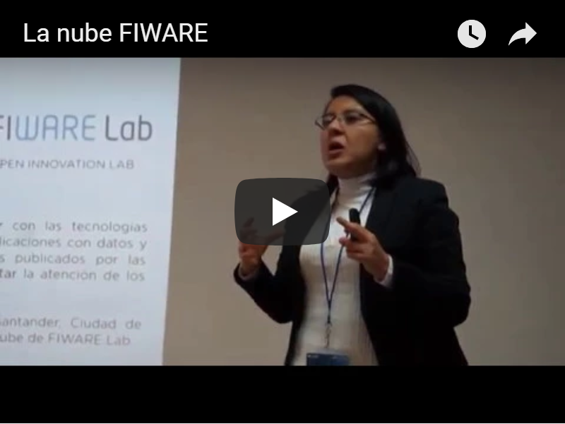
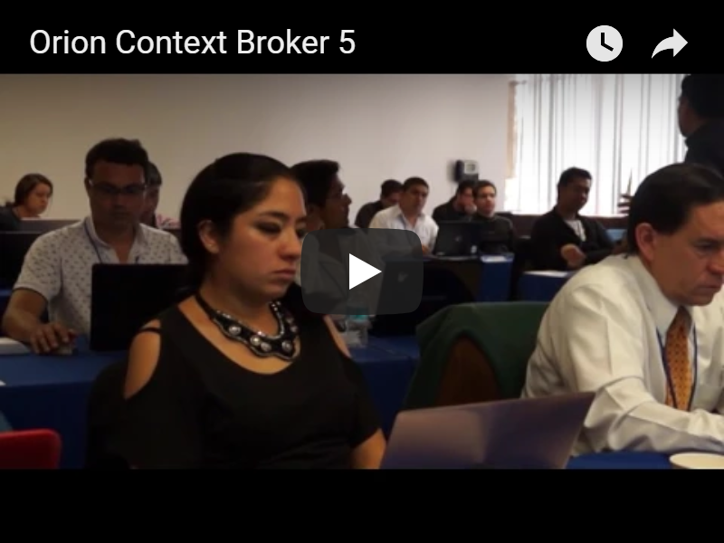

# Capacitación presencial en FIWARE

En esta capacitación se aborda la plataforma FIWARE y componentes que facilitan el desarrollo de aplicaciones basadas en cómputo en la nube, Big Data e Internet de las Cosas. Comprenderás la potencialidad de la plataforma y obtendrás las capacidades teórico/prácticas para desarrollar aplicaciones utilizando sus componentes, así como para replicar el conocimiento adquirido a desarrolladores, integradores y proveedores de hardware y software interesados en generar soluciones innovadoras basadas en FIWARE.

## Ecosistema FIWARE
FIWARE es un ecosistema de emprendimiento abierto creado en Europa, que fomenta la innovación y el desarrollo de soluciones inteligentes. Cuenta con una plataforma de software pública y libre de regalías conformada por un conjunto de componentes de software que permiten reducir el tiempo de desarrollo de una solución inteligente y aumentar su modularidad, su escalabilidad y su flexibilidad. Asimismo, brinda capacidades de cómputo en la nube basadas en OpenStack (FIWARE Lab).

En estos videos se introduce al ecosistema de innovación y emprendimiento abierto de FIWARE.

## La nube de FIWARE
La nube de FIWARE (FIWARE Lab) es un ambiente sandbox (entorno de pruebas separado del entorno de producción) no comercial para experimentar e innovar con las tecnologías de FIWARE. FIWARE Lab está conformado por nodos federados desplegados sobre una red distribuida alrededor del mundo.

En este video se explica la nube de FIWARE basada en Openstack. Así como la creación de una cuenta en FIWARE Lab y la configuración de un ambiente virtual en la nube.

 

## Gestión de información de contexto
La información de contexto se refiere a información que describe el "estado" actual de todo lo que está sucediendo al alrededor de una "cosa" y que es relevante, como es la última información reportada por los sesnsores o capturada por cualquier otro sistema externo.

En este video se explica cómo FIWARE maneja la información de contexto con uno de sus principales componentes: el Orion Context Broker.

## Componente "Orion Context Broker"
Orion Context Broker es el principal componente de la plataforma FIWARE. Este componente se encarga de la gestión de la información de contexto y permite la publicación de datos de entidades (por ejemplo los sensores), de manera que la información de contexto publicada se encuentre disponible para que sea consultada por otras entidades interesadas en procesar la información (por ejemplo una aplicación móvil que usa la información de los sensores). Las operaciones básicas del Orion Context Broker son: a) registrar aplicaciones de proveedores de contexto, por ejemplo: un sensor de temperatura dentro de una habitación; b) actualizar información de contexto, por ejemplo: enviar actualizaciones de la temperatura; c) ser notificado cuando surjan los cambios en la información de contexto (por ejemplo cuando la temperatura ha cambiado), o con una frecuencia determinada (por ejemplo, obtener la temperatura cada minuto); d) consultar información de contexto.

En los siguientes videos se describe el funcionamiento del Orion Context Broker y las principales funciones de su API NGSI v2. Además se realiza la instalación del ambiente de prácticas y se realizan operaciónes con el Orion Context Broker: a) Creación de Entidades, b) Búsqueda de entidades, c) Actualización de entidades y d) Subscripciones

## Componente "Kurento"
Kurento es un framework de desarrollo que proporciona una capa de abstracción para capacidades multimedia, permitiendo a los desarrolladores no expertos incluir componentes de multimedia interactivos a sus aplicaciones.

En estos videos se describe el funcionamiento de Kurento para procesamiento de imagenes en tiempo real.

## Componente "WireCloud"
WireCloud proporciona una plataforma mashup de aplicaciones web que permite a los usuarios finales, sin habilidades de programación, crear aplicaciones web y dashboards/cockpits (por ejemplo, para visualizar sus datos de interés o para controlar su casa o medio ambiente). 

En este video se describe el funcionamiento de WireCloud, una plataforma para generación de dashboards.

