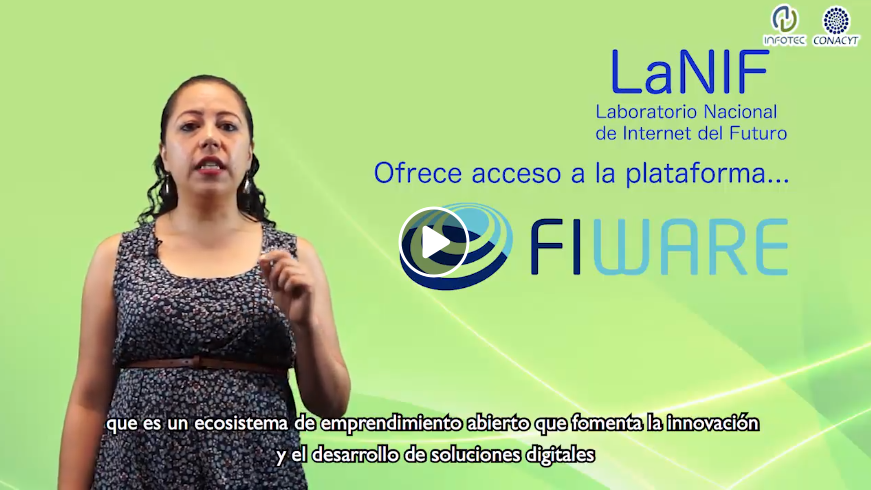

# LaNIF y la tecnología FIWARE

En este video te presentamos el Laboratorio Nacional de Internet del Futuro, un espacio de experimentación para el desarrollo de 
soluciones inteligentes utilizando la tecnología de FIWARE. FIWARE es un ecosistema de emprendimiento abierto creado en Europa que 
proporciona componentes de software que facilitan el desarrollo de soluciones inteligentes en múltiples sectores verticales.

Te invitamos a conocer esta iniciativa y a unirte a la comunidad de FIWARE en México. 

