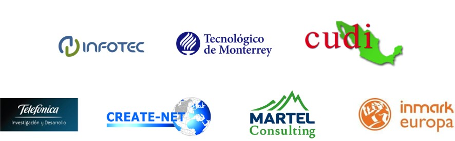

# Proyecto FIWARE México
El proyecto FIWARE México (<http://www.fiwaremexico.org/>) aborda el desafío impulsar la colaboración basada en FIWARE entre México y Europa, centrándose en la adopción, implementación y mejora de FIWARE en México. Esta colaboración se utilizará como un marco para abrir nuevos horizontes para futuras cooperaciones en el dominio de las TIC.

FIWARE México involucra la definición de procesos, herramientas, know-how e incentivos que permitan crecer la comunidad de FIWARE en México y Latinoamérica,  así como crear un ambiente de colaboración sostenible entre México y Europa.

## Objetivos
**Objetivo 1:** diseñar e implementar un programa de entrenamiento en FIWARE a desarrolladores, integradores y contribuidores de hardware y software, asegurando la transferencia del “saber-como” de FIWARE a los actores relevantes en México. 

**Objetivo 2:** establecer e implementar grupos de trabajo para apoyar la adopción de tecnologías FIWARE, mediante la participación de investigadores, emprendedores, start-ups, PyMEs, usuarios finales y tomadores de decisiones de ciudades en México. 

**Objetivo 3:** apoyar la estrategia de cooperación entre México y Europa en FIWARE y en términos generales en el ámbito de las TIC, mediante la identificación de los temas de investigación futuros más viables y otros medios de cooperación. 

**Objetivo 4:** identificar e impulsar sinergias basadas en FIWARE que faciliten la creación de redes de colaboración, organizar acciones conjuntas que promocionen FIWARE en México y fortalecer la colaboración entre México y Europa dentro del contexto general de las TIC.

**Objetivo 5:** incrementar la visibilidad de los resultados del proyecto y dar a conocer las oportunidades para la colaboración en FIWARE entre México y Europa.  

## Consorcio
Para llevar a cabo el desarrollo y logro de los objetivos del proyecto, se cuenta con un consorcio que involucra a 7 organizaciones de Europa (España, Italia, Suiza) y México. 
  

##  
**El proyecto FIWARE México es cofinanciado por el programa marco Horizonte 2020 de la Unión Europea y el Consejo Nacional de Ciencia y Tecnologia (CONACYT).**

  

