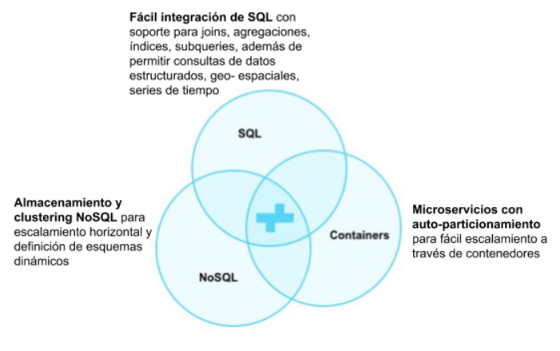

# CrateDB

Entre las tecnologías utilizadas para realizar el almacenamiento de grandes volúmenes de datos se encuentra CrateDB, una base de datos SQL distribuida y construida sobre una plataforma NoSQL que controla el almacenamiento, indexación e interconectividad, facilitando una mayor rapidez, flexibilidad y escalabilidad a comparación de bases de datos relacionales mientras que permite al usuario acceder a los datos a través de sentencias SQL comunes.
Existen varias ventajas para trabajar con herramientas BigData con las características de CrateDB. Primeramente, es una plataforma "hibrida" entre los esquemas tradicionales de bases de datos relacionales y no relacionales (NoSQL).
Los esquemas NoSQL tienen la capacidad de manejar grandes volúmenes de datos que crece rápidamente y cuya estructura también se actualiza ya que permiten almacenar información estructurada, semi-estructurada y sin una estructura específica.

Su arquitectura permite distribuir la información a través de un número arbitrario de servidores de manera nativa y automática (Auto-sharding, Replicación), permitiendo una alta disponibilidad y redundancia de la información a diferencia de las bases de datos relacionales que deben de prescindir de espacio y capacidad de cómputo para lograr un mejor rendimiento en las transacciones o fragmentando la arquitectura a través de estructuras complejas.
CrateDB retoma las características de NoSQL al definir una arquitectura de clúster de servidores coordinados (nodos) donde la ejecución de operaciones de lectura y escritura es distribuida automáticamente entre ellos. El escalamiento y administración del clúster se puede llevar acabo fácilmente a través de la orquestación de contenedores con plataformas como Docker o Kubernetes en un ambiente de micro-servicios.
El acceso a datos en CrateDB se define mediante la implementación de SQL. Al ser un lenguaje ampliamente utilizado, robusto y de fácil integración, su adopción es de gran alcance entre plataformas y desarrolladores. Soporta joins, funciones de agregación, subqueries, índices, blobs así como la mayoría de las características del estándar de SQL; CrateDB además integra funcionalidades particulares de NoSQL: búsquedas full-text, consultas geoespaciales y columnas anidadas de objetos JSON.
El escalamiento y replicación de tablas se hace de igual forma con SQL y el motor de CrateDB se encarga de distribuir los fragmentos (shards) y réplicas de forma automática, paralelizando la ejecución de consultas en los fragmentos y replicando la información en el clúster.

A continuación, se define la creación de una tabla en SQL donde además se indica la forma en que se particiona la tabla y el número de fragmentos y réplicas que tendrá, una funcionalidad particular de CrateDB:

```
CREATE TABLE IF NOT EXISTS t1 (
"ts" TIMESTAMP ,
"tenant_id" INTEGER ,
"sensor_id" STRING ,
"v1" INTEGER ,
"v3" FLOAT ,
"v5" BOOLEAN ,
"week_generated" TIMESTAMP GENERATED ALWAYS AS date_trunc ('week', ts)
) with (number_of_replicas = 2)
PARTITIONED BY ( "week_generated" )
CLUSTERED BY ( "tenant_id" ) INTO 3 SHARDS;
```

La flexibilidad de la arquitectura de CrateDB -NoSQL- permite definir la forma en que el esquema de una tabla se modifica. Cuando una sentencia INSERT incluye una columna no definida en la tabla, CrateDB se puede configurar para:

- Obligar a que el esquema de la tabla se mantenga y rechazar las sentencias INSERT incorrectas.
- Actualizar dinámicamente el esquema de la tabla, agregando la nueva columna de la sentencia INSERT.

Internamente, cada registro es almacenado como un documento JSON, cuya estructura puede cambiar en tiempo de ejecución. Esta capacidad permite flexibilizar el manejo de las estructuras de datos.
El usuario puede acceder a la información almacenada y la configuración a través de una interfaz web, una API y diversos clientes como Java, JDBC, Python, PHP, Erlang oficialmente, y Ruby, Scale, Node.js, Mono, .NET, Go, Vim, Perl, soportados por la comunidad de desarrollo.
Fig. 1 muestra la funcionalidad de CrateDB con base a la combinación de tecnologías NoSQL, SQL y contenedores.

  
  *Fig. 1. Funcionalidad de CrateDB*
  
Con estos atributos, CrateDB se adecúa al contexto IoT y su procesamiento para análisis y visualización de series de tiempo (una serie de puntos indexados por un orden de tiempo secuencial) al posibilitar:

- Consumo de millones de datapoints por segundo.
- Versatilidad en la consulta de datos, desde series de tiempo, información geoespacial (geo-queries), búsqueda de texto, funciones de agregación, entre otras.
- Versatilidad de los datos, como lecturas de sensores estructuradas y desestructuradas, mensajes de red, información geoespacial, logs de eventos.
- Alto rendimiento al analizar datos en tiempo real y grandes volúmenes, realizar monitoreo de dispositivos interconectados y proveer información a los usuarios.
- De fácil escalabilidad al contemplar el crecimiento de los datos, dispositivos y usuarios.
- Lenguaje de consulta SQL.
- Soporta la integración de herramientas de visualización.


