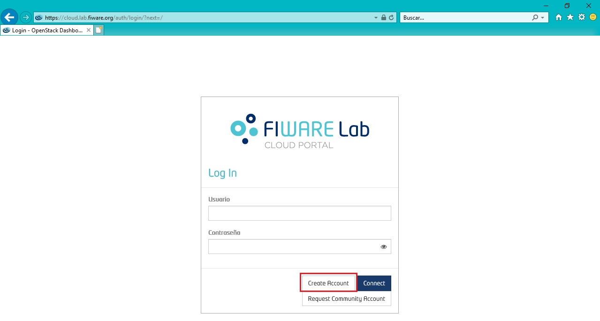
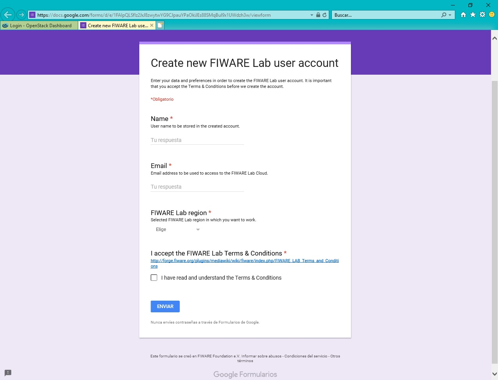

# La nube de FIWARE (FIWARE Lab)

Para tener acceso a FIWARE Lab, es necesario contar con una cuenta que brinde acceso a un espacio que permite el despliegue de una infraestructura virtual necesaria para experimentar con las tecnologías de internet de las cosas, cómputo en la nube y Big Data, a través de los GEs disponibles en FIWARE.

Consulta los términos de privacidad [Términos de privacidad](https://goo.gl/kIjJhA) y los [Términos y condiciones de uso de FIWARE Lab](https://goo.gl/cVSeNq), así como las [Políticas para obtener una cuenta Community](https://goo.gl/CeWN9b) en el nodo FIWARE Lab de México.

## Tipos de cuenta 
**Basic**

**Trial**

**Community**

## Solicita una cuenta en FIWARE Lab
Para solicitar una cuenta Community, deberá llenar un formulario de solicitud desde el sitio web de
[FIWARE Lab](https://cloud.lab.fiware.org), donde se le solicita describir de manera breve su proyecto y listar los componentes
de FIWARE que utilizará durante la ejecución de su proyecto.  
Las instrucciones para solicitar una cuenta Community en el nodo FIWARE Lab de México se describen a continuación. 

1. Ingrese a la página de FIWARE Lab: <https://cloud.lab.fiware.org>
2. Seleccione la opción "Request Community Account".
  
  
3.	Aparecerá un formulario con los siguientes campos:
    - User full name: ingrese su nombre completo.
    - User account email: ingrese el correo electrónico con el que registró su cuenta básica en FIWARE Lab.
    - Are you already registrered in FIWARE Lab? YES – NO: confirme que ha creado una cuenta básica en FIWARE Lab. 
    - Company: indique la compañía / institución a la que pertenece. 
    - Department: indique el departamento al que pertenece. 
    - Number of developers: indique el número de desarrolladores involucrados en su proyecto. 
    - Startup / Project name: indique el nombre de su startup o proyecto.
    - Accelerator programe name: seleccione la opción (México).
    - Accelerator submission name: deje este espacio en blanco. 
    - Startup / Project description: describa su proyecto incluyendo los siguientes puntos: 
      - Objetivo
      - Áreas de aplicación (turismo, salud, seguridad, etc.)
      - Descripción de la aplicación que desea desarrollar y sus beneficios
      - Tiempo estimado de desarrollo
      - Recursos de FIWARE que impactan a su proyecto
    - Preferred FIWARE Lab Node: Seleccione México
    - Proof of concept URL: (en caso de tenerla) indique la URL donde se pueda acceder a la prueba de concepto de su proyecto (demo).
       
Los siguientes campos son para indicar los recursos de nube que requiere para su proyecto:
    - User full name: ingrese su nombre completo.
    - Number of VMs: indique el número de máquinas virtuales (MVs) que requiere para su proyecto.
    - Total # vCPUs: indique el número total de CPUs virtuales que utilizarán sus máquinas virtuales. Por ejemplo: si requiere 1 CPU por cada máquina virtual y en total son 3 máquinas virtuales entonces requerirá 3 CPUs. 
    - Total RAM: indique el total de RAM que requiere en su proyecto (en Gb). Por ejemplo: si requiere 2 Gb por cada máquina virtual y en total son 3 máquinas virtuales entonces requerirá 6 Gb de RAM.  
    - Total harddisk: indique cuanto espacio de almacenamiento requiere para su proyecto (en Gb). Por ejemplo: si requiere 30 Gb por cada máquina virtual y en total son 3 máquinas virtuales entonces requerirá 90 Gb de espacio de almacenamiento.  
    - # public IPs: indique el número de IPs públicas que requiere en su proyecto. Por favor considere que se trata de un recurso escaso y costoso. El uso de soluciones como proxies, le permitirá desarrollar sus aplicaciones utilizando solamente una IP. 
    - Object storage: si requiere un Object Storage (arquitectura de almacenamiento que gestiona datos como objetos), indique cuanto espacio necesita (en Gb). Tenga en cuenta que no todos los nodos cuentan con el servicio de Object Storage. 
    - Additional comments /requirements / essential questions: indique si tiene algún comentario adicional, requerimiento o pregunta. Por ejemplo: una máquina virtual con más recursos de los máximos establecidos por defecto.  
    - Name: indique su nombre (opcional).
    - Email: indique un correo electrónico (opcional).

Haga clic en el botón “Submit” para que el formulario de solicitud de cuenta Community sea enviado. 

  
