# Creación de una máquina virtual en FIWARE Lab
En esta sección se presentan los pasos a seguir para crear una máquina virtual en FIWARE Lab.
Cada máquina virtual que se genere, debe tener asignado un grupo de seguridad y un par de claves. Por lo tanto, el primer paso es generar el grupo de seguridad y el par de claves. En el grupo de seguridad se definen los puertos que tendrá abiertos y restricciones de acceso, el par de claves es necesario para conectarse a ella través de ssh.
Una vez que se cuenta con estos dos requisitos, se genera la máquina virtual a partir de imágenes de diferentes sistemas operativos disponibles en FIWARE Lab y finalmente se le asigna una dirección IP, para poder tener acceso a ella desde la web.

## Iniciar sesión
Ingresar a la página de [FIWARE Lab](https://cloud.lab.fiware.org/)
Introducir el correo y la contraseña y dar clic en el botón Connect.

  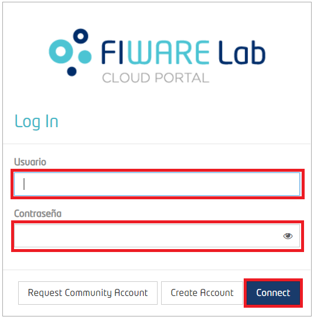

Al iniciar sesión, aparece la vista general, en donde se muestran los recursos disponibles en la cuenta community, así como el nivel de utilización de los recursos.

  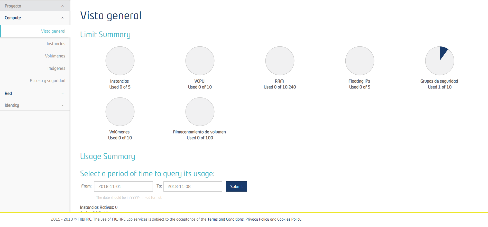

## Grupos de seguridad

En los grupos de seguridad se establecen los puertos que la máquina virtual tendrá abiertos, además se puede permitir el acceso a la máquina virtual a una sola IP o a un rango de IPs. En caso de que no sea necesario restringir el acceso, se puede dejar la opción por default que permite el acceso a la máquina virtual desde cualquier IP.
Por defecto, en la cuenta se genera el grupo de seguridad “default” y también es posible crear grupos nuevos.
En caso de que cada máquina virtual requiera una configuración diferente, es posible asignar un grupo de seguridad diferente a cada una de ellas. Si todas las máquinas virtuales requieren la misma configuración, se puede asignar el mismo grupo de seguridad a todas.
De manera indistinta se puede utilizar el grupo default o crear grupos nuevos dependiendo de las necesidades de administración de las máquinas virtuales.

**"Grupo default"**
Seleccionar la opción “Acceso y seguridad” del menú y la pestaña “Grupos de seguridad”.

  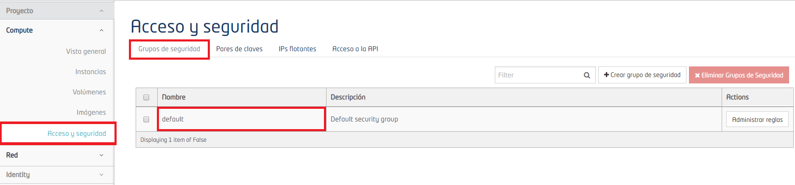

Para verificar los puertos abiertos y/o agregar más puertos, dar clic en el botón “Administrar reglas”.

  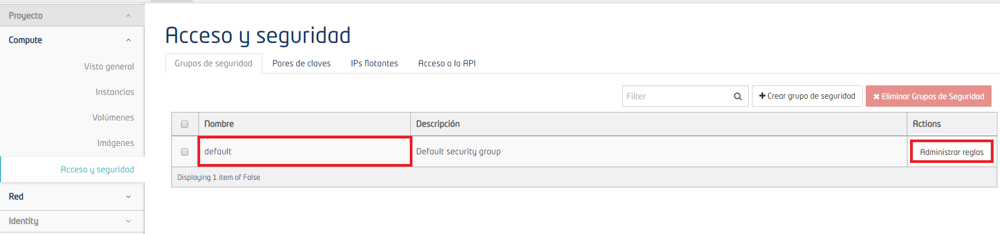

Para agregar un puerto, dar clic en el botón “+Agregar regla”. El único puerto que aparece abierto es el 22, para permitir la conexión a través de ssh.

  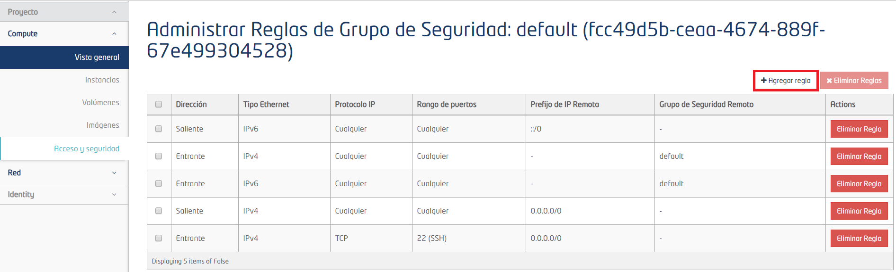

Aparece una ventana como la siguiente:

  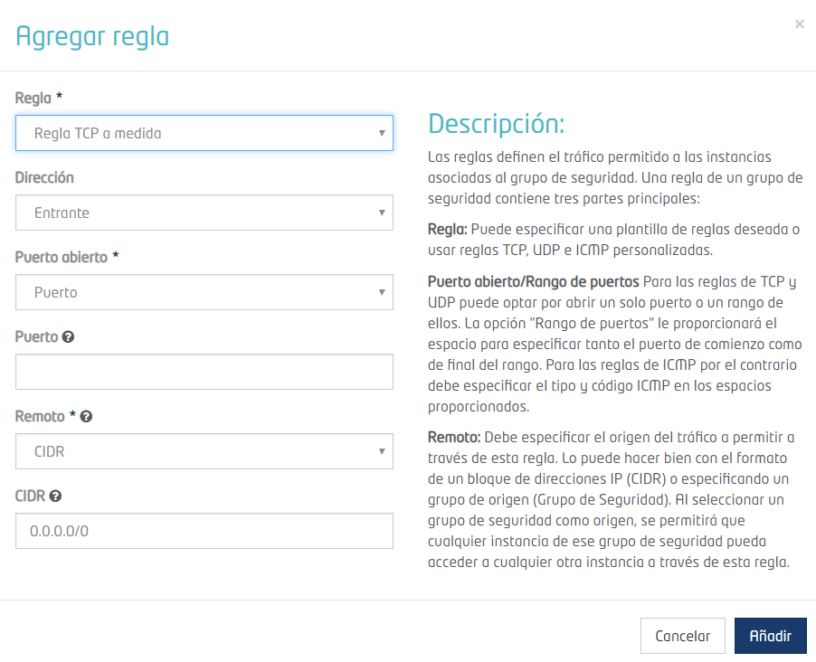

Elegir un puerto de la lista desplegable "Regla". En este caso se eligió HTTPS. Una vez seleccionado el puerto dar clic en el botón "Añadir".

  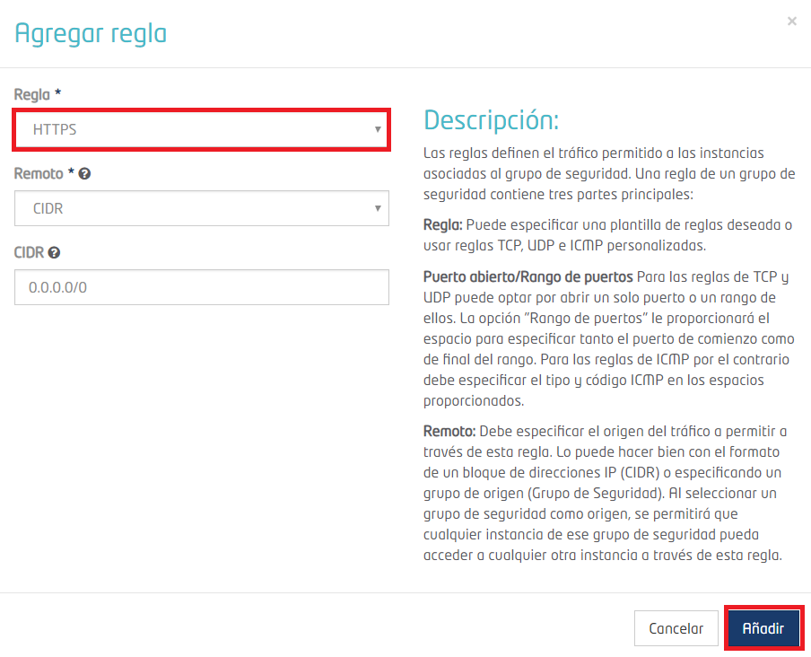

En la lista, aparecerá el puerto que se agregó. En caso de que se requiera eliminar el puerto, dar clic en el botón "Eliminar regla".

  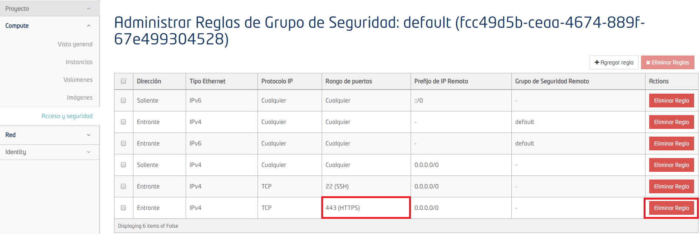

En caso de que el puerto que se requiere abrir no se encuentre en la lista desplegable, dar clic en el botón “+Agregar regla”, agregar el número en el campo “Puerto” y dar clic en el botón “Añadir”.

  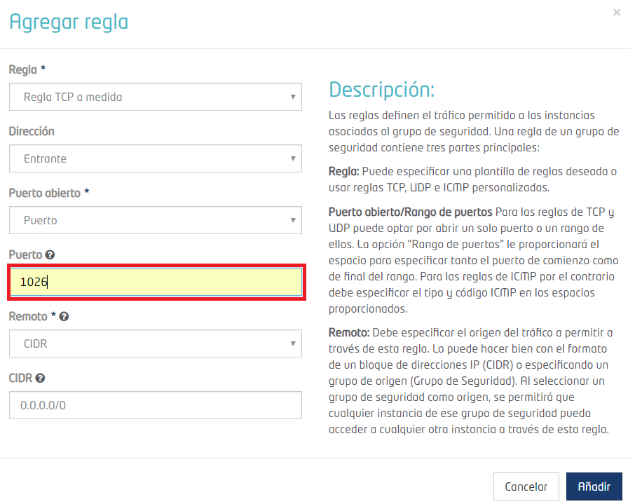

Sí es necesario permitir el acceso a la máquina virtual a una sola IP o rango de IPs, se especifica en el campo “CIDR”. Dar clic en el botón “Añadir”.

  

Una vez que se añade el puerto, aparece como nueva regla. En la imagen se observa que se puede iniciar sesión ssh a través de cualquier IP. Sin embargo, al puerto 1026 únicamente se puede tener acceso a través del rango de IPs definido.

  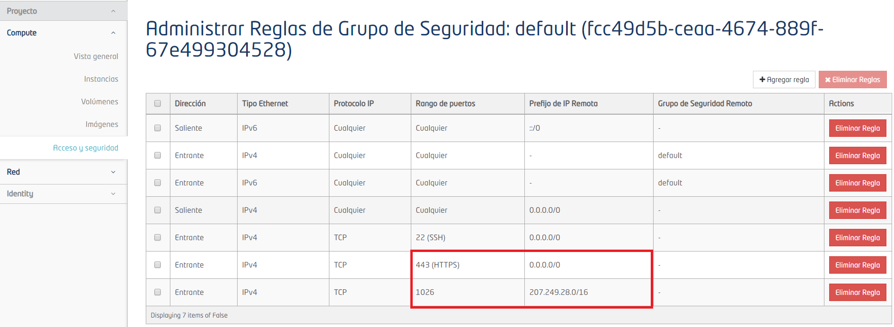

**"Grupo nuevo"**
Seleccionar la opción “Acceso y seguridad” del menú, ir a la pestaña “Grupos de seguridad” y dar clic en el botón “+Crear grupo de seguridad”.

  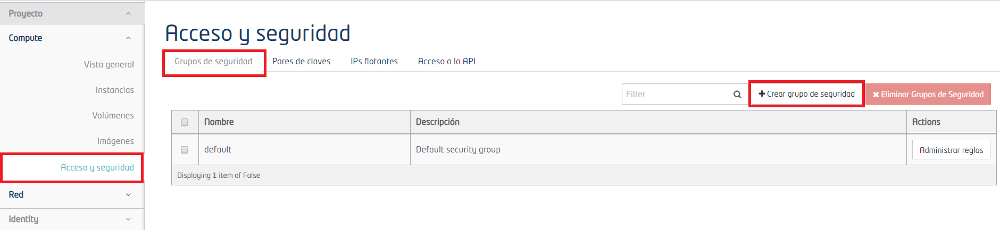

Definir un nombre y descripción para el grupo de seguridad y dar clic en el botón “Crear grupo de seguridad”.

  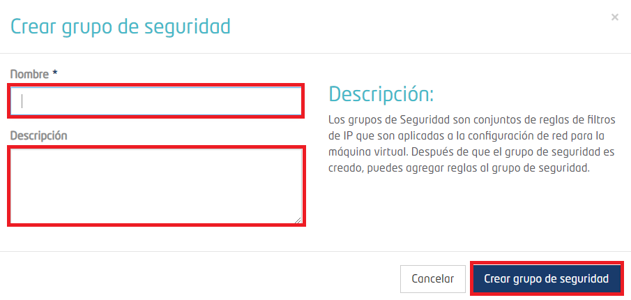

Una vez creado el grupo, aparecerá de la siguiente forma:

  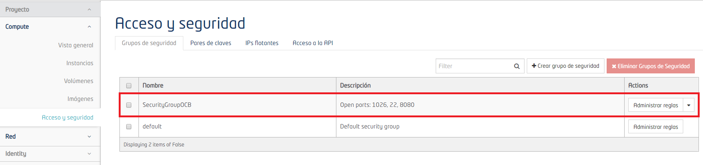

Para agregar un puerto dar clic en el botón “Administrar reglas”.

  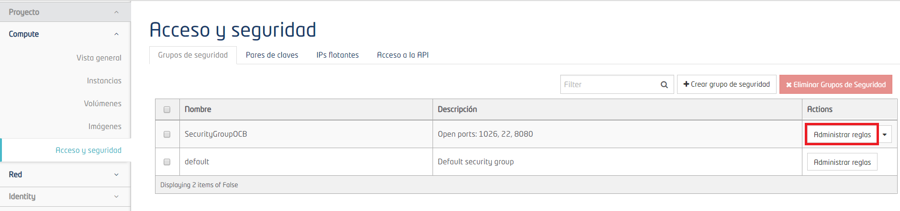

Posteriormente dar clic en el botón “+Agregar regla”.

  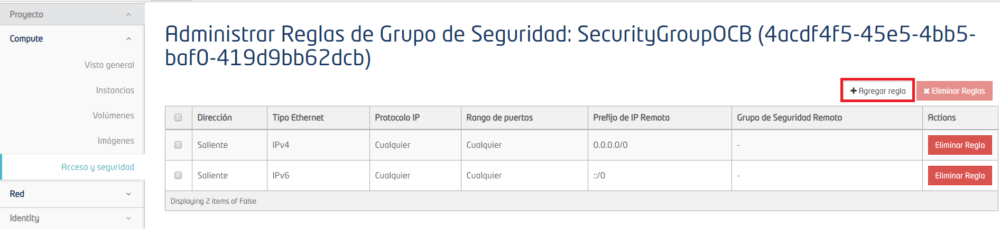

Aparece una ventana como la siguiente:

  

El primer puerto que se debe abrir es el 22, para permitir la conexión ssh. Se puede agregar el número 22 en el campo “Puerto” o seleccionar la opción SSH del menú desplegable del campo “Regla”. Una vez seleccionado el puerto dar clic en el botón "Añadir".

  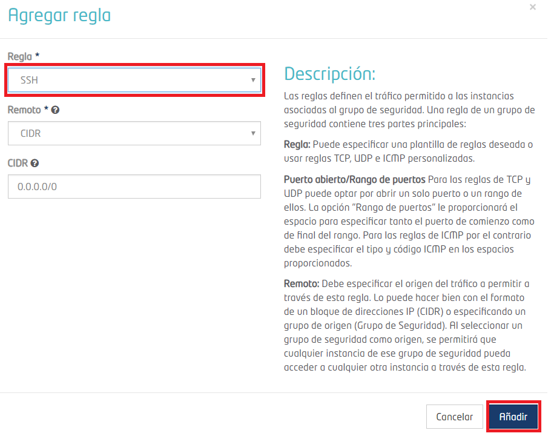
