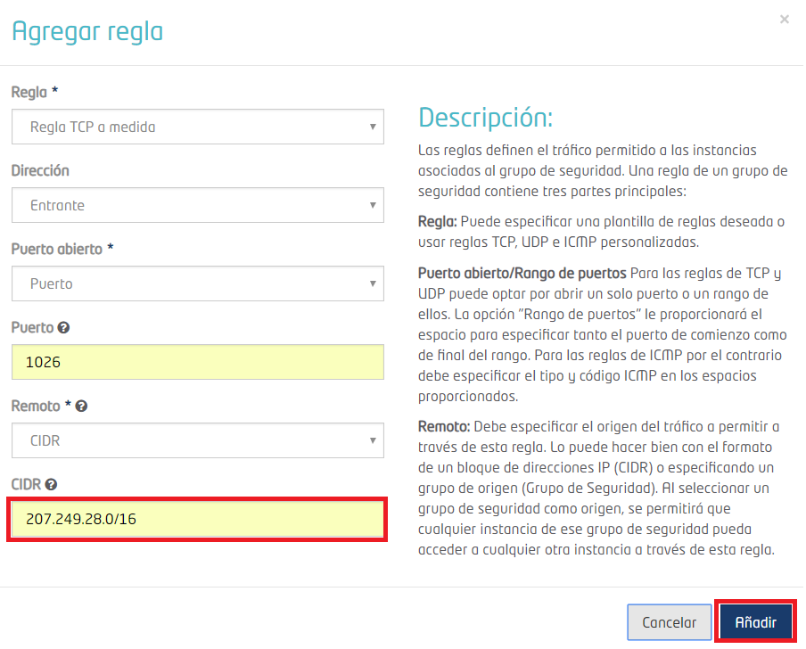
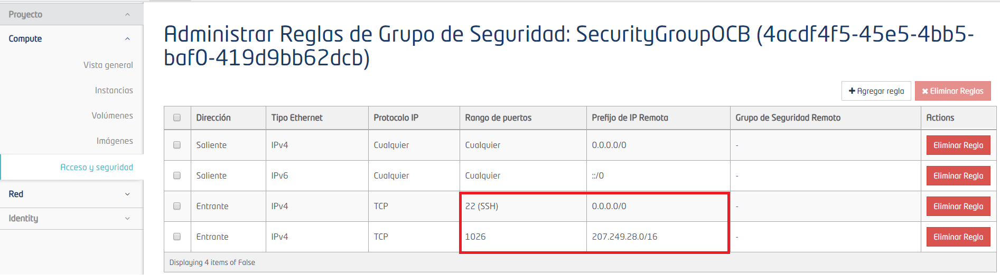
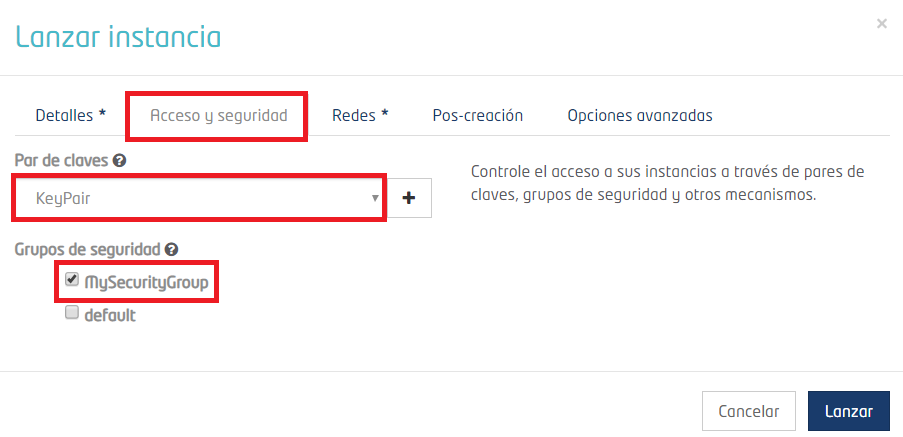

# Creación de una máquina virtual en FIWARE Lab
En esta sección se presentan los pasos a seguir para crear una máquina virtual en FIWARE Lab.
Cada máquina virtual que se genere, debe tener asignado un grupo de seguridad y un par de claves. Por lo tanto, el primer paso es generar el grupo de seguridad y el par de claves. En el grupo de seguridad se definen los puertos que tendrá abiertos y restricciones de acceso, el par de claves es necesario para conectarse a ella través de ssh.
Una vez que se cuenta con estos dos requisitos, se genera la máquina virtual a partir de imágenes de diferentes sistemas operativos disponibles en FIWARE Lab y finalmente se le asigna una dirección IP, para poder tener acceso a ella desde la web.

## Iniciar sesión
Ingresar a la página de [FIWARE Lab](https://cloud.lab.fiware.org/)
Introducir el correo y la contraseña y dar clic en el botón Connect.

  

Al iniciar sesión, aparece la vista general, en donde se muestran los recursos disponibles en la cuenta community, así como el nivel de utilización de los recursos.

  

## Grupos de seguridad

En los grupos de seguridad se establecen los puertos que la máquina virtual tendrá abiertos, además se puede permitir el acceso a la máquina virtual a una sola IP o a un rango de IPs. En caso de que no sea necesario restringir el acceso, se puede dejar la opción por default que permite el acceso a la máquina virtual desde cualquier IP.
Por defecto, en la cuenta se genera el grupo de seguridad “default” y también es posible crear grupos nuevos.
En caso de que cada máquina virtual requiera una configuración diferente, es posible asignar un grupo de seguridad diferente a cada una de ellas. Si todas las máquinas virtuales requieren la misma configuración, se puede asignar el mismo grupo de seguridad a todas.
De manera indistinta se puede utilizar el grupo default o crear grupos nuevos dependiendo de las necesidades de administración de las máquinas virtuales.

### Grupo default
Seleccionar la opción “Acceso y seguridad” del menú y la pestaña “Grupos de seguridad”.

  

Para verificar los puertos abiertos y/o agregar más puertos, dar clic en el botón “Administrar reglas”.

  

Para agregar un puerto, dar clic en el botón “+Agregar regla”. El único puerto que aparece abierto es el 22, para permitir la conexión a través de ssh.

  

Aparece una ventana como la siguiente:

  

Elegir un puerto de la lista desplegable "Regla". En este caso se eligió HTTPS. Una vez seleccionado el puerto dar clic en el botón "Añadir".

  

En la lista, aparecerá el puerto que se agregó. En caso de que se requiera eliminar el puerto, dar clic en el botón "Eliminar regla".

  

En caso de que el puerto que se requiere abrir no se encuentre en la lista desplegable, dar clic en el botón “+Agregar regla”, agregar el número en el campo “Puerto” y dar clic en el botón “Añadir”.

  

Sí es necesario permitir el acceso a la máquina virtual a una sola IP o rango de IPs, se especifica en el campo “CIDR”. Dar clic en el botón “Añadir”.

  

Una vez que se añade el puerto, aparece como nueva regla. En la imagen se observa que se puede iniciar sesión ssh a través de cualquier IP. Sin embargo, al puerto 1026 únicamente se puede tener acceso a través del rango de IPs definido.

  

### Grupo nuevo
Seleccionar la opción “Acceso y seguridad” del menú, ir a la pestaña “Grupos de seguridad” y dar clic en el botón “+Crear grupo de seguridad”.

  

Definir un nombre y descripción para el grupo de seguridad y dar clic en el botón “Crear grupo de seguridad”.

  

Una vez creado el grupo, aparecerá de la siguiente forma:

  

Para agregar un puerto dar clic en el botón “Administrar reglas”.

  

Posteriormente dar clic en el botón “+Agregar regla”.

  

Aparece una ventana como la siguiente:

  

El primer puerto que se debe abrir es el 22, para permitir la conexión ssh. Se puede agregar el número 22 en el campo “Puerto” o seleccionar la opción SSH del menú desplegable del campo “Regla”. Una vez seleccionado el puerto dar clic en el botón "Añadir".

  
  
  Aparece el puerto que se agregó. En caso de que se requiera eliminar el puerto, dar clic en el botón “Eliminar regla”.

  

Sí el puerto que se requiere abrir no se encuentra en la lista desplegable, dar clic nuevamente en el botón “+Agregar regla”, agregar el número en el campo “Puerto”. Sólo sí es necesario permitir el acceso a la máquina virtual a una sola IP o rango de IPs, se especifica en el campo “CIDR”.

  

Una vez que se añade el puerto, aparece como nueva regla. En la imagen se observa que se puede iniciar sesión ssh a través de cualquier IP. Sin embargo, al puerto 1026 únicamente se tiene acceso a través del rango de IPs definido.

  

### Eliminar grupo de seguridad

Seleccionar el menú “Acceso y seguridad”, seleccionar la pestaña “Grupos de seguridad”, seleccionar el grupo y dar clic en el botón “Eliminar Grupos de Seguridad”.

  

Otra opción para eliminar un grupo es la siguiente:  Seleccionar el menú “Acceso y seguridad”, seleccionar la pestaña “Grupos de seguridad”, dar clic en la flecha que se encuentra a un costado del botón “Administrar reglas” del grupo que se va a eliminar y seleccionar la opción “Eliminar grupo de seguridad”.

  

### Modificar grupo de seguridad

Para **modificar el nombre y descripción de un grupo de seguridad** ir al menú “Acceso y seguridad”, seleccionar la pestaña “Grupos de seguridad”, dar clic sobre la flecha que se encuentra a un costado del botón “Administrar reglas” del grupo que se desea editar y seleccionar la opción “Editar grupo de seguridad”.

  

Modificar el nombre y/o descripción del grupo y dar clic en el botón “Editar grupo de seguridad”.

  

Para **modificar las reglas definidas en un grupo de seguridad**, ir al menú “Acceso y seguridad”, seleccionar la pestaña “Grupos de seguridad”, dar clic sobre el botón “Administrar reglas” del grupo de seguridad que se desea modificar.

  

A continuación, aparecerán los puertos abiertos de la máquina virtual, dar clic en el botón “+Agregar regla” para añadir un nuevo puerto, o dar clic en el botón “Eliminar regla” del puerto que se requiera eliminar.

  

## Par de Claves

Para generar un par de claves ir al menú “Acceso y seguridad”, seleccionar la pestaña “Pares de claves” y dar clic en el botón “+Crear par de claves”.

  

Escribir un nombre para el par de claves y dar clic en el botón “Crear par de claves”.

  

El par de claves se descarga de manera automática y se almacena en la carpeta de Descargas en la computadora, en caso de que el archivo no se descargue, dar clic en el link “Descargar par de claves “KeyPair””. En este caso “KeyPair” es el nombre que se le asignó al par de claves.
**Nota importante: Si el par de claves no se descarga en este paso, ya no es posible descargarla después. El par de claves es necesario para tener acceso por ssh a la máquina virtual.**

  

## Creación de una máquina virtual

Ir al menú “Instancias” y dar clic en el botón “Lanzar instancia”.

  

 En la pestaña “Detalles” llenar el formulario:
    - "Zona de disponibilidad": el valor por default es nova.
    - "Nombre de la instacia": nombre que se le asignará a la máquina virtual.
    - "Sabor": recursos que se le asignarán a la máquina virtual (CPU, Disco y Memoria RAM).
    - "Recuento de instancias": número de máquinas virtuales que se van a generar. El número depende de los recursos disponibles.
    - "Origen de arranque de la instancia": en este caso se seleccionó la opción "Arrancar desde una imagen".
    - "Nombre de la imagen": seleccionar el sistema operativo que se instalará en la máquina virtual.

  

En la pestaña “Acceso y seguridad”, seleccionar el par de claves y el grupo de seguridad.

  

Verificar que haya una red seleccionada, como se muestra en la imagan y dar clic en el botón “Lanzar”.

  

Posteriormente aparecerán los datos de la máquina virtual que se generó.

  
