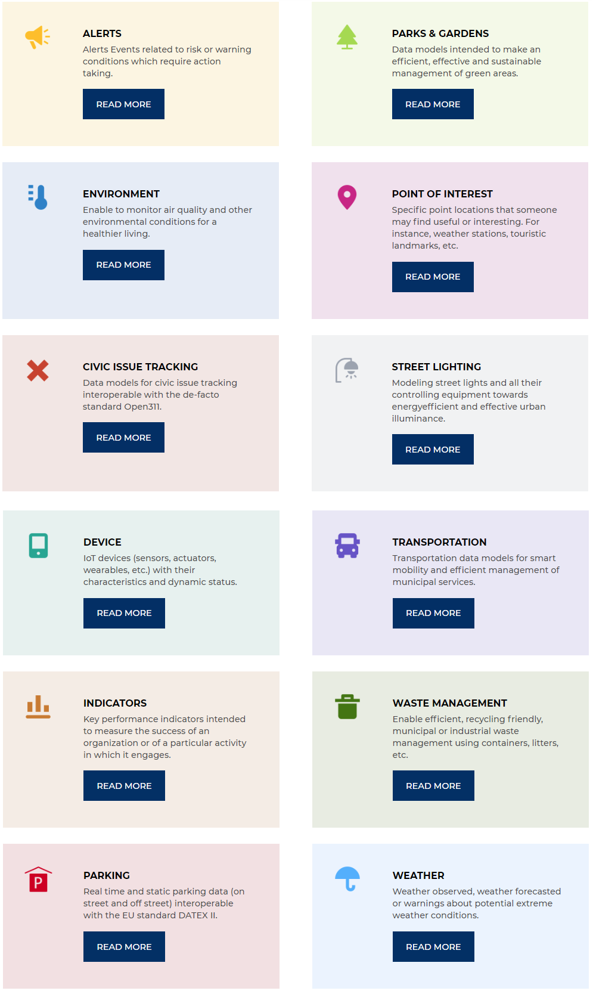

# Modelos de datos de FIWARE
Los modelos de datos se han armonizado para permitir la portabilidad de datos para diferentes aplicaciones, incluidas, entre otras, Smart Cities. Están destinados a ser utilizados junto con FIWARE NGSI versión 2.

