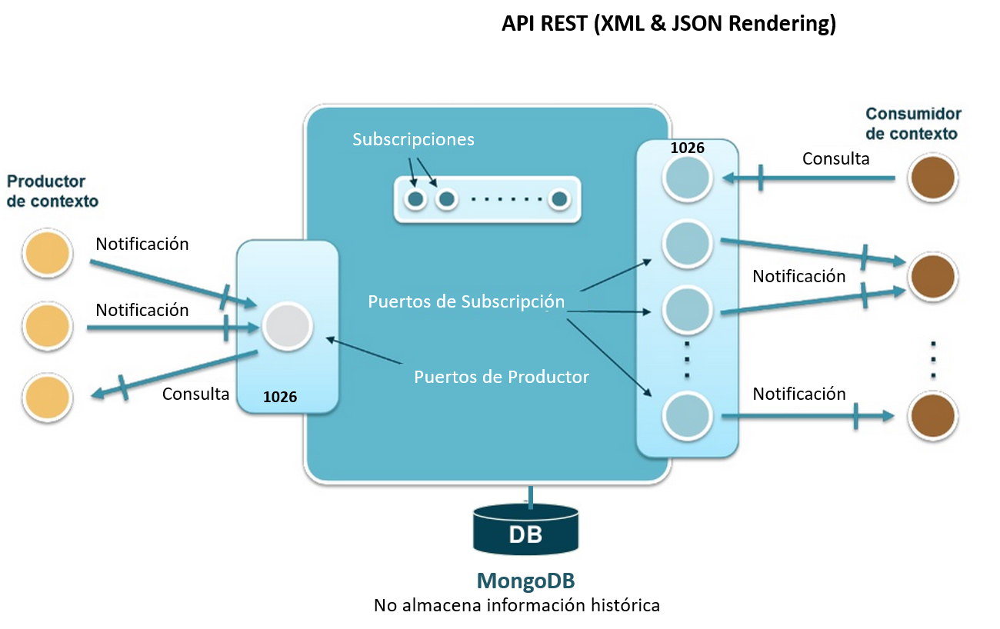
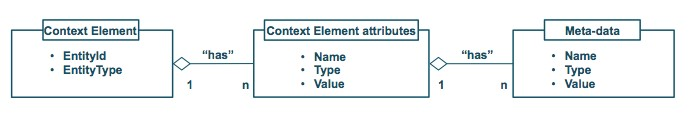
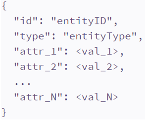
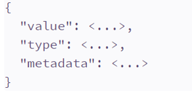
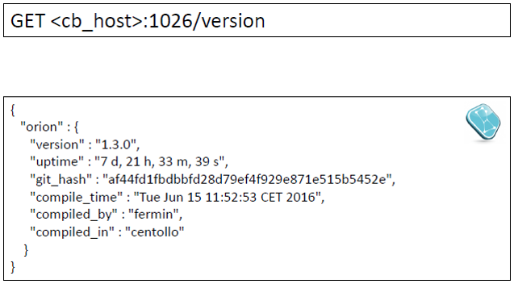

# Orion Context Broker
El principal y único componente obligatorio de cualquier plataforma o solución desarrollada con FIWARE es el Orion Context Broker (OCB), el cual aporta una función fundamental en cualquier solución inteligente: administrar la información de contexto, consultarla y actualizarla.

El OCB permite la publicación de información de contexto por entidades (llamados productores de contexto) por ejemplo los sensores, de manera que la información de contexto publicada se encuentre disponible para otras entidades (consumidores de contexto) los cuales están interesados en procesar la información, por ejemplo una aplicación para smartphones que usa la información de los sensores. 
Los proveedores de contexto y los consumidores de contexto pueden ser cualquier aplicación o incluso otros componentes dentro de la plataforma FIWARE (Fig. 1). 

El OCB es un servidor que implementa una API que se basa en el modelo de información NGSI, por medio de la cual se pueden realizar varias operaciones: 
- Registrar aplicaciones de proveedores de contexto, por ejemplo: un sensor de temperatura dentro de una habitación. 
- Actualizar información de contexto, por ejemplo: enviar actualizaciones de la temperatura. 
- Ser notificado cuando surjan los cambios en la información de contexto (por ejemplo cuando la temperatura ha cambiado), o con una frecuencia determinada (por ejemplo, obtener la temperatura cada minuto).
-	Consultar información de contexto. Orion almacena la información de contexto actualizada desde las aplicaciones, por lo tanto, las consultas se resuelven basados en esta información. 

El servidor OCB siempre está escuchando en un puerto que generalmente es el 1026 (aunque se puede cambiar). el OCB utiliza la base de datos es mongoDB para almacenar el estatus actual de las entidades, no se almacena información histórica de sus cambios. Para este propósito se debe utilizar una base de datos externa al OCB. 

 

Un principio fundamental soportado por el OCB es el de lograr una disociación total entre productores y consumidores de contexto. Es decir, los productores de contexto publican datos sin saber qué, dónde y cuándo los consumidores de contexto consumirán los datos publicados; por lo tanto, no necesitan estar conectados a ellos. Por otro lado, los consumidores de contexto consumen información de contexto de su interés, sin que conozcan al productor de contexto que publica un evento en particular. Están interesados en el evento en sí, y no en quien lo generó.  

## Modelo NGSI
Toda la comunicación entre los distintos componentes de la arquitectura de alto nivel del OCB se realiza a través de la API RESTful NGSI v2, la cual es inspirada y basada en la especificación [OMA NGSI](http://technical.openmobilealliance.org/Technical/release_program/docs/NGSI/V1_0-20101207-C/OMA-TS-NGSI_Context_Management-V1_0-20100803-C.pdf). Por lo tanto, la información de contexto en FIWARE está representada a través de estructuras de datos genéricos referidos como elementos de contexto. 

Un elemento de contexto se refiere a la información que es producida, recopilada u observada y que puede ser relevante para su procesamiento, análisis y extracción de nuevo conocimiento. Tiene asociado un valor definido, que consiste en una secuencia de uno o más triplas <name, type, value> que se refieren a atributos de un elemento de contexto. FIWARE soporta un conjunto de tipos de datos básicos, así como la posibilidad de definir tipos de datos estructurados; vectores y mapas clave (cuyos elementos pueden ser otros vectores, mapas clave o tipos de datos simples). 
Un elemento de contexto (ContextElements) proporciona información relevante a una entidad en particular, la cual puede ser un componente físico o parte de una aplicación. Por ejemplo, un elemento de contexto puede contener valores de atributos asociados a una habitación como la última temperatura medida, los metros cuadrados que mide y el color de la pared. Por lo general, elemento de contexto contiene un id (EntityId) y un tipo (EntityType) que identifica exclusivamente a una entidad. Además pueden existir metadatos, vinculados a los atributos a un elemento de contexto. Sin embargo, la existencia de metadatos vinculados a un atributo de elemento de contexto es opcional (Fig. 2). 
La información de contexto en OMA NGSI se representa a través de estructuras de datos llamadas elementos de contexto (ContextElements), los cuales tienen asociado: 

- Un EntityId y un EntityType único que identifica la entidad a la cual los datos de contexto hacen referencia. 
- Una secuencia de uno o más atributos de elementos de datos (triplas <name, type, value>).
-	Metadatos opcionales vinculados a atributos (también triplas <name, type, value>).

 

## API RESTful NGSI v2
La API FIWARE NGSI (Next Generation Service Interface) define:
- Un modelo de datos para la información de contexto, basada en un modelo de información simple usando la noción de entidades de contexto.
- Una interfaz de datos de contexto para el intercambio de información por medio de operaciones de consulta, suscripción y actualización.
- Una interfaz de disponibilidad de contexto para el intercambio de información sobre cómo obtener información de contexto (si se separan o no ambas interfaces está aún bajo discusión).

### Representación de una entidad en JSON
El "payload" de respuesta de la  API en esta especificación se basan en application/json y  (para atributos del tipo “operation”) en los tipos MIME text/plain. Los clientes enviando peticiones HTTP con “accept types” diferentes de éstos recibirán un error del tipo 406 Not Acceptable.

El identificador de la entidad se especifica mediante la propiedad "id" del objeto, cuyo valor es una cadena que contiene el identificador de la identidad.
El tipo de entidad se especifica por la propiedad "type" del objeto, cuyo valor es una cadena que contiene el nombre del tipo de entidad.

Los atributos de la entidad se especifican mediante propiedades adicionales:
- El nombre del atributo se especifica mediante la propiedad "name", cuyo valor es una cadena que contiene el nombre del atributo. 
- El valor del atributo se especifica mediante la propiedad "value", cuyo valor puede ser cualquier tipo JSON.
- El tipo de atributo se especifica por la propiedad "type", cuyo valor es una cadena que contiene el tipo NGSI.
- El atributo metadata se especifica en la propiedad "metadata". Su valor es otro objeto JSON, que contiene una propiedad por elementos de metadatos definidos (el nombre de la propiedad es el nombre del elemento de metadatos).

*No se permite usar "id" y "type" como nombres de atributos.

Representación de una entidad: 

Representación de un atributo: 

### Operaciones con la API RESTful NGSI v2
- Comprobación de la versión

- Operaciones con entidades

  - GET /v2/entities (devuelve todas las entidades)
  - POST /v2/entities (crea una entidad)
  - GET /v2/entities/{entityID} (devuelve una entidad)
  - [PUT|PATCH|POST] /v2/entities/{entityID} (actualiza una entidad)
  - DELETE /v2/entities/{entityID} (borra una entidad)
  - GET /v2/entities/{entityID}/attrs/{attrName} (devuelve los datos de un atributo)
  - PUT /v2/entities/{entityID}/attrs/{attrName} (actualiza un dato de un atributo)
  - DELETE /v2/entities/{entityID}/attrs/{attrName} (borra un atributo)
  - GET /v2/entities/{entityID}/attrs/{attrName}/value (devuelve el valor de un atributo)
  - PUT /v2/entities/{entityID}/attrs/{attrName}/value (actualiza el valor de un atributo)

 
