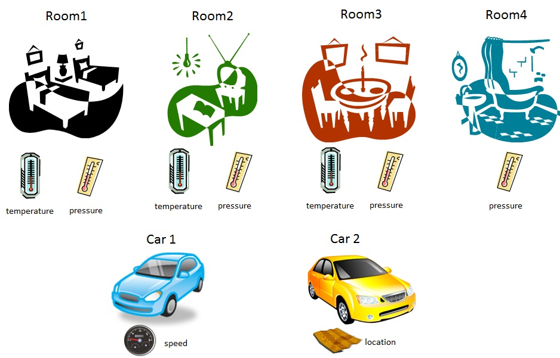

# Orion Context Broker
El principal y único componente obligatorio de cualquier plataforma o solución desarrollada con FIWARE es el Orion Context Broker (OCB), el cual aporta una función fundamental en cualquier solución inteligente: administrar la información de contexto, consultarla y actualizarla.

El OCB permite la publicación de información de contexto por entidades (llamados productores de contexto) por ejemplo los sensores, de manera que la información de contexto publicada se encuentre disponible para otras entidades (consumidores de contexto) los cuales están interesados en procesar la información, por ejemplo una aplicación para smartphones que usa la información de los sensores. 
Los proveedores de contexto y los consumidores de contexto pueden ser cualquier aplicación o incluso otros componentes dentro de la plataforma FIWARE (Fig. 1). 

El OCB es un servidor que implementa una API que se basa en el modelo de información NGSI, por medio de la cual se pueden realizar varias operaciones: 
- Registrar aplicaciones de proveedores de contexto, por ejemplo: un sensor de temperatura dentro de una habitación. 
- Actualizar información de contexto, por ejemplo: enviar actualizaciones de la temperatura. 
- Ser notificado cuando surjan los cambios en la información de contexto (por ejemplo cuando la temperatura ha cambiado), o con una frecuencia determinada (por ejemplo, obtener la temperatura cada minuto).
-	Consultar información de contexto. Orion almacena la información de contexto actualizada desde las aplicaciones, por lo tanto, las consultas se resuelven basados en esta información. 

El servidor OCB siempre está escuchando en un puerto que generalmente es el 1026 (aunque se puede cambiar). el OCB utiliza la base de datos es mongoDB para almacenar el estatus actual de las entidades, no se almacena información histórica de sus cambios. Para este propósito se debe utilizar una base de datos externa al OCB. 

 

Un principio fundamental soportado por el OCB es el de lograr una disociación total entre productores y consumidores de contexto. Es decir, los productores de contexto publican datos sin saber qué, dónde y cuándo los consumidores de contexto consumirán los datos publicados; por lo tanto, no necesitan estar conectados a ellos. Por otro lado, los consumidores de contexto consumen información de contexto de su interés, sin que conozcan al productor de contexto que publica un evento en particular. Están interesados en el evento en sí, y no en quien lo generó.  

## Modelo NGSI
Toda la comunicación entre los distintos componentes de la arquitectura de alto nivel del OCB se realiza a través de la API RESTful NGSI v2, la cual es inspirada y basada en la especificación [OMA NGSI](http://technical.openmobilealliance.org/Technical/release_program/docs/NGSI/V1_0-20101207-C/OMA-TS-NGSI_Context_Management-V1_0-20100803-C.pdf). Por lo tanto, la información de contexto en FIWARE está representada a través de estructuras de datos genéricos referidos como elementos de contexto. 

Un elemento de contexto se refiere a la información que es producida, recopilada u observada y que puede ser relevante para su procesamiento, análisis y extracción de nuevo conocimiento. Tiene asociado un valor definido, que consiste en una secuencia de uno o más triplas <name, type, value> que se refieren a atributos de un elemento de contexto. FIWARE soporta un conjunto de tipos de datos básicos, así como la posibilidad de definir tipos de datos estructurados; vectores y mapas clave (cuyos elementos pueden ser otros vectores, mapas clave o tipos de datos simples). 
Un elemento de contexto (ContextElements) proporciona información relevante a una entidad en particular, la cual puede ser un componente físico o parte de una aplicación. Por ejemplo, un elemento de contexto puede contener valores de atributos asociados a una habitación como la última temperatura medida, los metros cuadrados que mide y el color de la pared. Por lo general, elemento de contexto contiene un id (EntityId) y un tipo (EntityType) que identifica exclusivamente a una entidad. Además pueden existir metadatos, vinculados a los atributos a un elemento de contexto. Sin embargo, la existencia de metadatos vinculados a un atributo de elemento de contexto es opcional (Fig. 2). 
La información de contexto en OMA NGSI se representa a través de estructuras de datos llamadas elementos de contexto (ContextElements), los cuales tienen asociado: 

- Un EntityId y un EntityType único que identifica la entidad a la cual los datos de contexto hacen referencia. 
- Una secuencia de uno o más atributos de elementos de datos (triplas <name, type, value>).
-	Metadatos opcionales vinculados a atributos (también triplas <name, type, value>).

 

## API RESTful NGSI v2
La API FIWARE NGSI (Next Generation Service Interface) define:
- Un modelo de datos para la información de contexto, basada en un modelo de información simple usando la noción de entidades de contexto.
- Una interfaz de datos de contexto para el intercambio de información por medio de operaciones de consulta, suscripción y actualización.
- Una interfaz de disponibilidad de contexto para el intercambio de información sobre cómo obtener información de contexto (si se separan o no ambas interfaces está aún bajo discusión).


### Representación de una entidad en JSON
El "payload" de respuesta de la  API en esta especificación se basan en application/json y  (para atributos del tipo “operation”) en los tipos MIME text/plain. Los clientes enviando peticiones HTTP con “accept types” diferentes de éstos recibirán un error del tipo 406 Not Acceptable.

El identificador de la entidad se especifica mediante la propiedad "id" del objeto, cuyo valor es una cadena que contiene el identificador de la identidad.
El tipo de entidad se especifica por la propiedad "type" del objeto, cuyo valor es una cadena que contiene el nombre del tipo de entidad.

Los atributos de la entidad se especifican mediante propiedades adicionales:
- El nombre del atributo se especifica mediante la propiedad "name", cuyo valor es una cadena que contiene el nombre del atributo. 
- El valor del atributo se especifica mediante la propiedad "value", cuyo valor puede ser cualquier tipo JSON.
- El tipo de atributo se especifica por la propiedad "type", cuyo valor es una cadena que contiene el tipo NGSI.
- El atributo metadata se especifica en la propiedad "metadata". Su valor es otro objeto JSON, que contiene una propiedad por elementos de metadatos definidos (el nombre de la propiedad es el nombre del elemento de metadatos).

*No se permite usar "id" y "type" como nombres de atributos.

Representación de una entidad: 
```
{
  "id": "entityID",
  "type": "entityType",
  "attr_1": <val_1>,
  "attr_1": <val_1>,
}
```

Representación de un atributo: 
```
{
  "value": <...>,
  "type": <...>,
  "metadata": <...>
}
```


## Interacción con la API RESTful NGSI v2
Se puede utilizar un cliente REST para enviar peticiones HTTP.

Se requiere especificar:

- El método HTTP (GET, POST, PUT, DELETE, OPTIONS, HEAD, TRACE, CONNECT)

- La URL (que incluye la IP del Orion Context Broker y la operación a realizar. Por ejemplo: http://207.249.127.46:1026/v2/entities

- Cabeceras (headers): 
```
Content-Type: "application/json"
Accept: application/json
```

- El  cuerpo de la petición


### Operaciones con la API RESTful NGSI v2

A continuación, se describirá un caso de estudio a través del cual se explicarán las operaciones que se pueden realizar con el Orion Context Broker.

Supongamos que tenemos un edificio con varias habitaciones y que queremos utilizar Orion Context Broker para administrar su información de contexto. Las habitaciones son Room1, Room2, Room3 y Room4 y cada habitación tiene dos sensores: temperatura y presión atmosférica (excepto Room4, que solo tiene un sensor de presión). Además, consideremos que tenemos dos autos (Car1 y Car2) con sensores capaces de medir la velocidad y la ubicación (con GPS).

 

El Orion Context Broker interactúa con las aplicaciones productoras de contexto (que proporcionan información de sensor) y una aplicación consumidora de contexto (que procesa esa información, por ejemplo, para mostrarla en una interfaz gráfica de usuario). En el caso de ejemplo, se realizarán ejercicios jugando el papel de ambos tipos de aplicaciones en los tutoriales.

- Comprobación de la versión

```
GET <cb_host>:1026/version
```

- Creación de una entidad
Se crearán las entidades Room1 y Room2, cada una con dos atributos: temperatura (temperature) y presión (pressure). Para ello, se utilizará la operación ```POST /v2/entities```.

Primero, se crea la Room1 suponiendo que al momento de la creación de la entidad, la temperatura y la presión de Room1 son de 23 ºC y 720 mmHg, respectivamente.

```
POST <cb_host>:1026/v2/entities
Header: Content-Type: "application/json"

{
  "id": "Room1",
  "type": "Room",
  "temperature": {
    "value": 23,
    "type": "Float"
  },
  "pressure": {
    "value": 720,
    "type": "Integer"
  }
}
```

Además de los campos ```id``` y ```type``` (que definen el ID y el tipo de entidad), el payload contiene un conjunto de atributos y cada attribruto contiene un valor y un tipo.

Una vez recibida esta solicitud, el Orion Context Broker creará la entidad en su base de datos interna, establecerá los valores para sus atributos y responderá con un código HTTP 201 indicando que la entidad se ha creado exitósamente.

Posteriormente se crea Room2 con temperatura y presión de 21 ºC y 711 mmHg, respectivamente.

```
POST <cb_host>:1026/v2/entities
Header: Content-Type: "application/json"

{
  "id": "Room2",
  "type": "Room",
  "temperature": {
    "value": 21,
    "type": "Float"
  },
  "pressure": {
    "value": 711,
    "type": "Integer"
  }
}
```

Además de los valores simples correspondientes a los tipos de datos JSON (es decir, números, cadenas, booleanos, etc.) para los valores de los atributos, Orion Context Broker también soporta estructuras complejas o metadatos personalizados. Estos temas avanzados pueden consultarse en [Valores estructurados para atributos](https://fiware-orion.readthedocs.io/en/1.11.0/user/structured_attribute_valued/index.html#structured-attribute-values) y [Metadatos de atributos](https://fiware-orion.readthedocs.io/en/1.11.0/user/metadata/index.html#custom-attribute-metadata).


  - Consulta de entidades
  Una aplicación consumidora de contexto es la que accede a la información de contexto almacenada en el Orion Context Broker para realizar algo con esa información, por ejemplo: mostrar un gráfico con la temperatura ambiente en una interfaz gráfica de usuario. En este caso se utiliza la operación ```GET / v2 / entities / {id} ```. 
  
 Para obtener la información de contexto de todas las entidades almacenadas en el Orion Context Broker se utiliza: 
   ```
  GET <cb_host>:1026/v2/entities
  ``` 
  
 Para obtener la información de contexto de Room1 se utiliza:  
  ```
  GET <cb_host>:1026/v2/entities/Room1
  ```

Podría darse el caso de tener dos o más entidades con el ```"id": "Room1"```, siempre y cuando el ```"type"``` sea diferente. En este caso se debe especificar el ```"type"``` de la entidad: 

 ```
  GET <cb_host>:1026/v2/entities/Room1?type=Room
 ```

En ambos casos, la respuesta incluye todos los atributos que pertenecen a Room1 y podemos verificar que la temperatura y la presión tienen los valores que se establecieron en la creación de la entidad con updateContext (23ºC y 720 mmHg).

```
{
    "id": "Room1",
    "pressure": {
        "metadata": {},
        "type": "Integer",
        "value": 720
    },
    "temperature": {
        "metadata": {},
        "type": "Float",
        "value": 23
    },
    "type": "Room"
}
``` 

Se puede utilizar la opción ```keyValues``` para obtener una representación breve y más compacta, incluyendo sólamente los valores de los atributos: 

 ```
  GET <cb_host>:1026/v2/entities/Room1?options=keyValues
 ```
 
Cuya respuesta es: 
```
 {
    "id": "Room1",
    "pressure": 720,
    "temperature": 23,
    "type": "Room"
}
```

También se puede usar la opción de ```values``` para obtener una representación aún más compacta, con una lista de valores de los atributos. En este caso, se necesita usar el parámetro URL ```attrs``` para especificar la orden. Por ejemplo, para especificar que envíe primero la temperatura y después la presión: 

```
  GET <cb_host>:1026/v2/entities/Room1?options=values&attrs=temperature,pressure
```

Cuya respuesta es: 
``` 
 [
    23,
    720
]
``` 

Ahora aplicamos la misma operación, pero con los ```attrs``` invertidos: 
```
  GET <cb_host>:1026/v2/entities/Room1?options=values&attrs=pressure,temperature
```
Cuya respuesta es: 
``` 
[
    720,
    23
]
``` 

También puede consultar un único atributo, usando la operación ```GET /v2/entities/{id}/attrs/{attrsName}```. Por ejemplo, para obtener solo la temperatura:

```
  GET <cb_host>:1026/v2/entities/Room1/attrs/temperature
```

Cuya respuesta es:
```
{
    "metadata": {},
    "type": "Float",
    "value": 23
}
```

También puede obtener solo el valor utilizando la operación ```GET /v2/entities/{id}/attrs/{attrsName}/value```. Tenga en cuenta que en este caso necesita usar el en Header: ```Accept: text/plain```, ya que el valor del atributo es de este tipo. 

```
 Accept: text/plain
 
 GET <cb_host>:1026/v2/entities/Room1/attrs/temperature/value
```

Cuya respuesta es:
```
23.0
```

Finalmente, tenga en cuenta que obtendrá un error en caso de que intente consultar una entidad o atributo no existente, como se muestra en los siguientes casos.

Solicitud: 

```
  GET <cb_host>:1026/v2/entities/Room5
```

Respuesta:
```
{
    "description": "The requested entity has not been found. Check type and id",
    "error": "NotFound"
}
```

Solicitud: 

```
  GET <cb_host>:1026/v2/entities/Room1/attrs/humidity
```

Respuesta:
```
{
    "description": "The entity does not have such an attribute",
    "error": "NotFound"
}
```

En ambos casos, el código de respuesta HTTP (no se muestra) es 404 Not Found.

- Obtener todas las entidades y aplicar filtros

Se pueden obtener todas las entidades con la operación ```GET /v2/entities```. 

```
GET <cb_host>:1026/v2/entities/
```

En el caso de ejemplo, la operación regresa Room1 y Room2: 
```
[
    {
        "id": "Room1",
        "pressure": {
            "metadata": {},
            "type": "Integer",
            "value": 720
        },
        "temperature": {
            "metadata": {},
            "type": "Float",
            "value": 23
        },
        "type": "Room"
    },
    {
        "id": "Room2",
        "pressure": {
            "metadata": {},
            "type": "Integer",
            "value": 711
        },
        "temperature": {
            "metadata": {},
            "type": "Float",
            "value": 21
        },
        "type": "Room"
    }
]
```

Al igual que con ```GET /v2/entities/{id}``` se pueden utilizar las opciones ```keyValues``` y ```values```. 

Además de proporcionar todo el conjunto de entidades, esta operación implementa capacidades de filtrado para ajustar la lista de entidades recuperadas a lo que necesita. En particular:

Se puede filtrar por el parámetro ```type```. Por ejemplo, para obtener todas las entidades de tipo Room (en este caso, Room1 y Room2) se puede usar:
```
GET <cb_host>:1026/v2/entities?type=Room
```

Se puede filtrar utilizando patrones de identificación de entidad con el parámetro ```idPattern``` (cuyo valor es una expresión regular). Por ejemplo, para obtener todas las entidades cuyo ID comienza con Room y va seguido de un número en el rango de 2 a 5 (en este caso, Room2) se puede usar (observe la línea de comando g en curl para evitar problemas con los corchetes):

```
GET <cb_host>:1026/v2/entities?idPattern=^Room[2-5]
```

Se puede filtrar con filtros de atributos utilizando el parámetro ```q```. Para una descripción completa, revise la sección "Simple Query Language" en la [especificación NGSIv2](http://telefonicaid.github.io/fiware-orion/api/v2/stable/). Por ejemplo, para obtener todas las entidades cuya temperatura es mayor que 22 (en este caso, Room1) se puede usar:
 
```
GET <cb_host>:1026/v2/entities?q=temperature>22
```

También se puede filtrar por ubicación geográfica. Este es un tema avanzado, descrito en la sección [capacidades de geolocalización](https://fiware-orion.readthedocs.io/en/1.11.0/user/geolocation/index.html#geolocation-capabilities) de la API walkthrough de FIWARE. 

Como comentario final, tenga en cuenta que, aunque el caso de ejemplo es muy simple (solo 2 entidades), Orion Context Broker puede gestionar millones de entidades en una implementación real. Por lo tanto, de forma predeterminada, solo se devuelven 20 entidades (lo cual está bien para este tutorial, pero probablemente no para un escenario de utilización real). Para aprender sobre cómo recuperar grandes conjuntos de entidades página por página, consulte la sección de [paginación](https://fiware-orion.readthedocs.io/en/1.11.0/user/pagination/index.html#pagination) de la API walkthrough de FIWARE.
 
  - Actualización de entidades 
  
Es posible actualizar el valor de los atributos de una entidad utilizando la operación ```PATCH /v2/entities/{id}/attrs```. Esto supone que el atributo ya existe en la entidad.  
Esta operación la realizan las aplicaciones productoras de contexto, es decir, una fuente de información de contexto. Por ejemplo una aplicación que en un momento dado quiere establecer la temperatura y presión de Room1 a 26.5 ºC y 763 mmHg respectivamente, por lo que emite la siguiente solicitud:
```
PATCH <cb_host>:1026/v2/entities/Room1/attrs

{
  "temperature": {
    "value": 26.5,
    "type": "Float"
  },
  "pressure": {
    "value": 763,
    "type": "Float"
  }
}
```

Como se puede observar, la estructura de la solicitud es muy similar a la utilizada por la operación de creación de entidad, excepto que el ```id```y el ```type``` de la entidad no están incluidos en el payload.

Al recibir esta solicitud, el Orion Context Broker actualiza los valores para los atributos de la entidad en su base de datos interna y responde con un 204 No Content.

Ahora se puede utilizar la operación de consulta de entidad para verificar que Room1 se haya actualizado correctamente.

También se puede utilizar la operación ```PUT /v2/entities/{id}/attrs/{attrName}/value``` para actualizar el valor de un atributo de una manera realmente compacta y dejando intacto el tipo de atributo. Por ejemplo, para actualizar la temperatura de Room1 a 28.4 (tenga en cuenta que la cabecera es ```Content-Type: "text/plain"```, que corresponde al valor 28.4):

```
Content-Type: "text/plain"

PUT <cb_host>:1026/v2/entities/Room1/attrs/temperature/value

28.4
```

Finalmente, la operación ```PUT /v2/entities/{id}/attrs``` se puede usar para reemplazar todos los atributos de una entidad dada, es decir, eliminar los que ya existían. 

Como en el caso de la creación de entidades, además de los valores simples correspondientes a los tipos de datos JSON (es decir, números, cadenas, booleanos, etc.) para los valores de los atributos, también puede usar estructuras complejas o metadatos personalizados. Estos temas avanzados pueden consultarse en [Valores estructurados para atributos](https://fiware-orion.readthedocs.io/en/1.11.0/user/structured_attribute_valued/index.html#structured-attribute-values) y [Metadatos de atributos](https://fiware-orion.readthedocs.io/en/1.11.0/user/metadata/index.html#custom-attribute-metadata).

- Suscripciones

Las operaciones con las que se ha familiarizado hasta ahora, para crear, consultar y actualizar entidades son los componentes básicos para las aplicaciones productoras y consumidoras de contexto de manera síncrona. Sin embargo, el Orion Context Broker tiene una potente característica: la capacidad de suscribirse a la información de contexto para que cuando "algo" ocurra (veremos ejemplos de ese "algo" más adelante), la aplicación reciba una notificación asíncrona. De esta manera, no es necesario que la aplicación envíe solicitudes de consulta continuamente. El Orion Context Broker le enviará la información cuando ésta se genere mediante una notificación. 

*IMPORTANTE*: Debe contar con un servidor configurado para recibir las notificaciones. En el ejemplo, el servidor está disponible desde la URL "url": http://localhost:1028/accumulate.

Para crear una suscripción, se utiliza la siguiente operación ```POST /v2/subscriptions```.  

Consideremos el siguiente ejemplo (tenga en cuenta que estamos usando -v para obtener el encabezado de ubicación en la respuesta, como se explica más adelante): 
```
Content-Type: application/json

POST <cb_host>:1026//v2/subscriptions

{
  "description": "A subscription to get info about Room1",
  "subject": {
    "entities": [
      {
        "id": "Room1",
        "type": "Room"
      }
    ],
    "condition": {
      "attrs": [
        "pressure"
      ]
    }
  },
  "notification": {
    "http": {
      "url": "http://localhost:1028/accumulate"
    },
    "attrs": [
      "temperature"
    ]
  },
  "expires": "2040-01-01T14:00:00.00Z",
  "throttling": 5
}
```
A continuación se describen a detalle los diferentes elementos que se incluyen en el payload: 

Los subcampos ```entities``` y ```attrs``` dentro de ```notifications``` definen el contenido de los mensajes de notificación. En el ejemplo, se especifica que la notificación debe incluir el atributo de temperatura (temperature) para la entidad Room1. 

La URL a donde enviar las notificaciones se define con el subcampo ```url```. Solo se puede incluir una URL por suscripción. Sin embargo, puede tener varias suscripciones con distintas URLs en los mismos elementos de contexto (es decir, la misma entidad y atributo). 

Las suscripciones pueden tener una fecha de vencimiento (campo ```expires```) especificado usando el formato estándar ISO 8601. Una vez que la suscripción sobrepasa esa fecha, simplemente se ignora (sin embargo, aún se encuentra almacenada en la base de datos del Orion Context Broker). Es posible ampliar la duración de una suscripción actualizándola (como se describe más adelante). En el ejemplo se utiliza una fecha lo suficientemente lejos en el tiempo (año 2040). 

Es posible tener suscripciones permanentes simplemente omitiendo el campo ```expires```.

El elemento ```conditions``` define el "disparador" para la suscripción. El campo ```attrs``` contiene una lista de nombres de atributos. Estos nombres definen los "atributos desencadenantes", es decir, atributos que al momento de la creación/cambio debido a la creación o actualización de la entidad activan la notificación. 

La regla es que si al menos uno de los atributos en la lista de ```conditions.attrs``` cambia (como una condición de tipo OR), entonces se envía la notificación. Por ejemplo, en este caso, cuando cambia la presión (pressure) de Room1, se notifica el valor de temperatura (temperature) de Room1, pero no la presión en sí. Si desea que se notifique también la presión, la solicitud debería incluir "pressure" dentro de la lista de ```notifications.attrs``` (o utilizar un vector de atributo vacío, que significa "todos los atributos en la entidad"). Ahora, en este ejemplo, ser notificado del valor de la temperatura cada vez que cambia el valor de la presión puede no ser demasiado útil. El ejemplo se elige de esta forma solo para mostrar la enorme flexibilidad de las suscripciones.

Puede dejar ```conditions.attrs``` vacíos para que cualquier cambio de atributo de entidad desencadene una notificación (independientemente del nombre del atributo). 

Las notificaciones incluyen los valores de los atributos después de procesar la operación de actualización que desencadena la notificación. Sin embargo, se puede hacer que el Orion Context Broker incluya también el valor anterior. Esto se logra utilizando [metadatos en las notificaciones](https://fiware-orion.readthedocs.io/en/1.11.0/user/metadata/index.html#metadata-in-notifications). 

También se puede establecer las suscripciones "notificar todos los atributos excepto algunos" (una especie de funcionalidad de "lista negra"). En este caso, se utiliza ```exceptAttrs``` en lugar de ```attrs``` dentro de ```notifications```.  

Puede incluir expresiones de filtrado en ```conditions```. Por ejemplo, para recibir notificaciones no solo si la presión cambia, sino si cambia dentro del rango 700-800. Este es un tema avanzado, consulte la sección "Suscripciones" en la [especificación NGSIv2](http://telefonicaid.github.io/fiware-orion/api/v2/stable/). 

El elemento de aceleración ```throttling``` se usa para especificar un tiempo mínimo de llegada entre notificaciones. Por lo tanto, establecer la aceleración en 5 segundos como en el ejemplo anterior, hace que una notificación no se envíe si se envió una notificación anterior hace menos de 5 segundos, sin importar cuántos cambios reales tengan lugar en ese período. Esto es para dar al receptor de notificación un medio para protegerse contra los productores de contexto que actualizan los valores de los atributos con demasiada frecuencia. En configuraciones multi-CB, tenga en cuenta que la última medida de notificación es local para cada nodo. Aunque cada nodo se sincroniza periódicamente con la base de datos para obtener valores potencialmente más nuevos ([más sobre esto aquí]), puede ocurrir que un nodo en particular tenga un valor anterior, por lo que el elemento ```throttling``` no es 100% preciso.  

La respuesta correspondiente a esa solicitud corresponde a un código HTTP 201 indicando que la suscripción se ha creado exitósamente. Además, contiene un encabezado de ubicación con el ID de la suscripción: un número hexadecimal de 24 caracteres que se utiliza para actualizar y cancelar la suscripción (anótelo para futuros ejercicios). 
```
< HTTP/1.1 201 Created
< Connection: Keep-Alive
< Content-Length: 0
< Location: /v2/subscriptions/57458eb60962ef754e7c0998
< Fiware-Correlator: 9ac7bbba-2268-11e6-aaf0-d48564c29d20
< Date: Wed, 25 May 2016 11:05:35 GMT
```

Ahora veremos el servidor acumulador. A continuación se presenta un ejemplo de la operación ```notifyContextRequest```:
```
POST http://localhost:1028/accumulate
Content-Length: 141
User-Agent: orion/1.1.0-next libcurl/7.38.0
Ngsiv2-Attrsformat: normalized
Host: localhost:1028
Accept: application/json
Content-Type: application/json; charset=utf-8
Fiware-Correlator: 3451e5c2-226d-11e6-aaf0-d48564c29d20

{
    "data": [
        {
            "id": "Room1",
            "temperature": {
                "metadata": {},
                "type": "Float",
                "value": 28.5
            },
            "type": "Room"
        }
    ],
    "subscriptionId": "57458eb60962ef754e7c0998"
}
```

El Orion Context Broker notifica suscripciones de contexto utilizando el método POST (en la URL de la suscripción). El payload incluye una referencia al ```id``` de la suscripción y un vector  El Orion Context Broker notifica suscripciones de contexto utilizando el método POST (en la URL de la suscripción). El payload incluye una referencia al ```id``` de la suscripción y un vector ```data``` con los datos actuales para las entidades. Tenga en cuenta que el formato de representación de la entidad es el mismo que el utilizado por las respuestas a la operación ```GET /v2/entities operation```.

La notificación fue recibida por el servidor acumulador ya que ésta se envía de manera síncrona durante la creación o actualización de la suscripción. Esta notificación es llamada [notificación inicial](https://fiware-orion.readthedocs.io/en/1.11.0/user/initial_notification/index.html). 

A continuación, se listan algunos ejercicios para practicar con las operaciones del Orion Context Broker: 

Actualizar la temperatura de Room1 a 27: no ocurrirá nada, ya que la temperatura no es el atributo desencadenante.

Actualizar la presión de Room1 a 765: recibirá una notificación con el valor actual de la temperatura de Room1 (27).

Actualizar la presión de Room1 a 765: no ocurre nada, ya que el intermediario es lo suficientemente astuto como para saber que el valor anterior a la solicitud de updateContext también era 765, por lo que no se ha producido ninguna actualización real y, en consecuencia, no se envía ninguna notificación.

Actualizar la presión de Room2 a 740: no ocurre nada, ya que la suscripción es para Room1, no Room2.

Las suscripciones pueden ser recuperadas utilizando ```GET /v2/subscriptions``` (que proporciona la lista completa y necesita [paginación](https://fiware-orion.readthedocs.io/en/1.11.0/user/pagination/index.html) si la lista es demasiado grande) o ```GET /v2/subscriptions/{subId}``` (para obtener una sola suscripción). Además, las suscripciones se pueden actualizar utilizando la operación ```PATCH /v2/subscription/{subId}```. Finalmente, una suscripción puede ser eliminada utilizando la operación ```DELETE /v2/subscriptions/{subId}```. 

- Consideraciones adicionales:

Las suscripciones pueden ser pausadas. Para hacer eso, simplemente configure el atributo ```status```a ```inactive``` (si desea reanudar la suscripción, vuelva a establecerla como "active"):
```
{
PATCH <cb_host>:1026/v2/subscriptions/57458eb60962ef754e7c0998
  "status": "inactive"
}
```

Las notificaciones se pueden personalizar de varias maneras. En primer lugar, se puede sintonizar el formato de representación de las entidades en las notificaciones, utilizando el campo ```attrsFormat``` dentro de ```notification```. En segundo lugar, se puede usar un verbo HTTP de notificación personalizado (por ejemplo PUT), personalizando las cabeceras HTTP, los parámetros de consulta y el payload (no necesariamente en JSON). Puede revisar las secciones "Notification Messages" y "Custom Notifications" en la [especificación de NGSIv2](http://telefonicaid.github.io/fiware-orion/api/v2/stable/).

