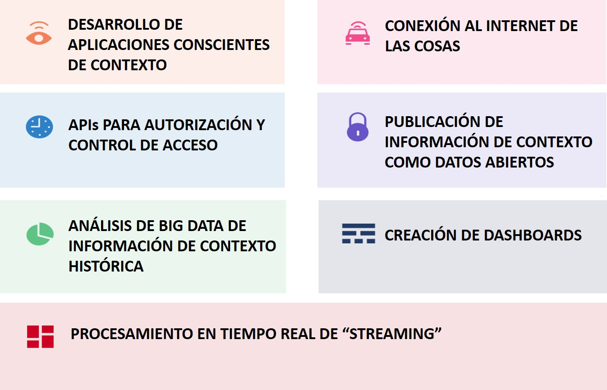

## Plataforma FIWARE
La [plataforma FIWARE](https://www.fiware.org/developers/catalogue/) es un marco de componentes de plataforma de código abierto que se puede ensamblar junto con otros componentes de plataforma de terceros para acelerar el desarrollo de soluciones inteligentes. Estos componentes de plataforma proporcionan APIs (interfaces de programación de aplicaciones) cuyas especificaciones son públicas y libres de regalías. Además, tienen disponible públicamente una implementación de referencia de código abierto para que los proveedores de FIWARE puedan salir rápidamente al mercado, con propuestas de bajo costo. 

El principal y único componente obligatorio de cualquier plataforma o solución "Powered by FIWARE" es el Context Broker (su implementación de referencia es llamada Orion Context Broker), que aporta una función fundamental en cualquier solución inteligente: la necesidad de administrar la información de contexto, lo que permite realizar actualizaciones y acceder al contexto. El Context Broker está rodeado por una suite de componentes de plataforma adicionales, que permiten suministrar datos de contexto de diversas fuentes y brindan soporte para el procesamiento, análisis y visualización de datos, así como para control de acceso a datos, publicación o monetización. Además, ofrece una serie de herramientas que facilitan la implementación y configuración de FIWARE o componentes de terceros y su integración con el Context Broker.

 

A continuación se presenta el catálogo de componentes de FIWARE categorizados en capítulos. 

## Catálogo de componentes de la plataforma FIWARE

### Capítulo "Gestión de Contexto"

### 

 

Consulta el [catálogo de FIWARE](https://www.fiware.org/developers/catalogue/) 
