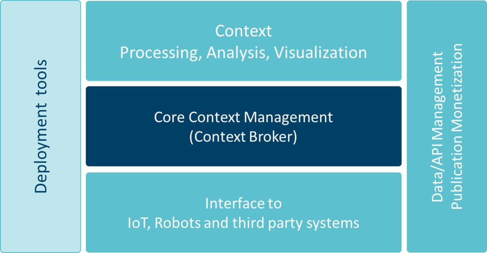

## Plataforma FIWARE
La [plataforma FIWARE](https://www.fiware.org/developers/catalogue/) se conforma de componentes de plataforma de código abierto que se puede ensamblar junto con otros componentes de plataforma de terceros para acelerar el desarrollo de soluciones inteligentes. Estos componentes de plataforma proporcionan APIs (interfaces de programación de aplicaciones) cuyas especificaciones son públicas y libres de regalías. Además, tienen disponible públicamente una implementación de referencia de código abierto para que los proveedores de FIWARE puedan salir rápidamente al mercado, con propuestas de bajo costo. 

El principal y único componente obligatorio de cualquier plataforma o solución "Powered by FIWARE" es el Context Broker (su implementación de referencia es llamada Orion Context Broker), que aporta una función fundamental en cualquier solución inteligente: la necesidad de administrar la información de contexto, lo que permite realizar actualizaciones y acceder al contexto. El Context Broker está rodeado por una suite de componentes de plataforma adicionales, que permiten suministrar datos de contexto de diversas fuentes  (Internet de las Cosas, robots y sistemas de terceros) y brindan soporte para el procesamiento, análisis y visualización de datos, así como para control de acceso a datos, publicación o monetización. Además, ofrece una serie de herramientas que facilitan la implementación y configuración de FIWARE o componentes de terceros y su integración con el Context Broker.

 

La suite de componentes de plataforma de FIWARE se describen a continuación. 

## Catálogo de componentes de la plataforma FIWARE
Los componentes de la plataforma FIWARE (Generic Enablers) se ecuentran estructurados en capítulos: Gestión de contexto, IoT, Robots y sistemas de terceros, Procesamiento, análisis y visualización de datos de contexto y Gestión de acceso, publicación y monetización de APIs y datos de contexto.

## Gestión de Contexto
- [Orion Context Broker](./ocb.md) es el componente central y obligatorio de cualquier plataforma o solución "Powered by FIWARE". Permite administrar la información de contexto de una manera altamente descentralizada y a gran escala. Proporciona la [API FIWARE NGSIv2](./ocb.md), la cual es una API Restful simple y muy potente que permite realizar actualizaciones, consultas o suscripciones a cambios en la información de contexto. El [Orion Context Broker](./ocb.md) mantiene la información del contexto actual. Sin embargo, la información de contexto evoluciona con el tiempo, creando un historial de contexto. Para apoyar el almacenamiento del historial de contexto existen los siguientes componentes: 

- [STH Comet](https://catalogue-server.fiware.org/enablers/sth-comet) proporciona los medios para almacenar un historial de datos de contexto a corto plazo (generalmente meses) en MongoDB.

- [Cygnus](https://catalogue-server.fiware.org/enablers/cygnus) brinda los medios para administrar el historial de contexto que se crea como una secuencia de datos que se puede inyectar en múltiples receptores de datos, incluidas algunas bases de datos populares como PostgreSQL, MySQL, MongoDB o AWS DynamoDB, así como plataformas BigData como Hadoop, Storm, Spark or Flink.

- [QuantumLeap](https://quantumleap.readthedocs.io/en/latest/) permite el almacenamiento de datos de la API FIWARE NGSIv2 a una base de datos de series de tiempo, conocida como ngsi-tsdb. Cuenta con un traductor de CrateDB con lo que se brindan las siguientes ventajas:
  - Escalabilidad fácil con clúster de base de datos en contenedores
  - Soporte de Geo-consultas
  - Lenguaje de consulta tipo SQL
  - Integración soportada con herramientas de visualización como Grafana

## IoT, Robots y sistemas de terceros
Existe una serie de componentes que facilitan la interfaz con el Internet de las cosas, robots y sistemas de terceros con el fin de recopilar información de contexto valiosa o desencadenar actuaciones en respuesta a actualizaciones de contexto:

- [IDAS](https://catalogue-server.fiware.org/enablers/backend-device-management-idas) ofrece una amplia gama de Agentes de IoT que facilita la interfaz con dispositivos que utilizan los protocolos de IoT más utilizados (LWM2M sobre CoaP, JSON o UltraLight sobre HTTP / MQTT u OPC-UA), así como un esqueleto para desarrollar su propio Agente IoT. 

Los siguientes componentes se encuentran en desarrollo dentro de este capítulo: 
- [Fast RTPS](https://catalogue-server.fiware.org/enablers/fast-rtps) ha sido adoptado como middleware por defecto en ROS2, el sistema operativo de robots ampliamente conocido, por lo tanto, ayuda a la interfaz con los sistemas de robótica. 

- [OpenMTC](https://catalogue-server.fiware.org/enablers/openmtc) brinda una implementación de código abierto del estándar OneM2M. Implementa una interfaz hacia el norte con Orion Context Broker.

## Procesamiento, análisis y visualización
Existe una serie de componentes que facilitan el proceso, el análisis o la visualización de la información de contexto con el fin de implementar el "comportamiento inteligente" esperado en cualquier aplicación:

- [WireCloud](https://catalogue-server.fiware.org/enablers/application-mashup-wirecloud) brinda una poderosa plataforma mashup web que facilita el desarrollo de tableros operativos (dashboards) que son altamente personalizables por los usuarios finales.

- [Knowage](https://catalogue-server.fiware.org/enablers/data-visualization-knowage) ofrece una potente plataforma de Business Intelligence que permite realizar análisis comerciales sobre fuentes tradicionales y sistemas de big data.

- [Kurento](https://catalogue-server.fiware.org/enablers/stream-oriented-kurento) permite el procesamiento en tiempo real de multimedia. Soporta la transformación de cámaras de video en sensores, así como la incorporación de funciones de aplicación avanzadas (comunicaciones audiovisuales integradas, realidad aumentada, reproducción y grabación de medios flexibles, etc.).

- [Cosmos](https://catalogue-server.fiware.org/enablers/bigdata-analysis-cosmos) permite un análisis más fácil de grandes cúmulos de información de contexto integrándose con las plataformas más populares de Big Data.  

Los siguientes componentes se encuentran en desarrollo dentro de este capítulo: 
- [FogFlow](https://catalogue-server.fiware.org/enablers/fogflow) es un marco de ejecución distribuido para admitir flujos de procesamiento dinámicos sobre la nube y los bordes.

- [AEON](https://catalogue-server.fiware.org/enablers/cloud-messaging-aeon) proporciona un canal de middleware para la rápida distribución de mensajes entre diferentes entidades.

- [Domibus](https://catalogue-server.fiware.org/enablers/electronic-data-exchange-domibus) ayuda a los usuarios a intercambiar datos electrónicos y documentos entre sí de una manera confiable y confiable.

## Gestión de acceso, publicación y monetización
- [Keyrock Identity Management](https://catalogue-server.fiware.org/enablers/identity-management-keyrock) brinda soporte para la autenticación segura y privada de usuarios y dispositivos basada en OAuth2, administración de perfiles de usuario, disposición de datos personales para preservar la privacidad, inicio de sesión único (SSO) y federación de identidad en múltiples dominios de administración.

- [Wilma](https://catalogue-server.fiware.org/enablers/pep-proxy-wilma) brinda soporte de funciones de proxy dentro de los esquemas de autenticación basados en OAuth2. También implementa funciones PEP dentro de un esquema de control de acceso basado en XACML.

- [AuthZForce PDP/PAP](https://catalogue-server.fiware.org/enablers/authorization-pdp-authzforce) brinda soporte a las funciones PDP / PAP dentro de un esquema de control de acceso basado en el estándar XACML.

Este capítulo también brinda componentes para la publicación y monetización de los recursos de datos de contexto, disponibles a través del componente principal Orion Context Broker de su plataforma:

- [CKAN extensions](https://catalogue-server.fiware.org/enablers/fiware-ckan-extensions) brinda una serie de complementos que permiten extender las capacidades actuales de la plataforma lider mundial para la publicación de datos abiertos CKAN, para permitir la publicación de conjuntos de datos que coincidan con los datos de contexto en el momento oportuno, la asignación de términos y políticas de acceso a esos conjuntos de datos y la asignación de precios y esquemas de pago por uso a conjuntos de datos.

- [Biz Framework](https://catalogue-server.fiware.org/enablers/business-api-ecosystem-biz-ecosystem-ri) brinda soporte de back-end a la monetización de datos/APIs de contexto basado en las APIs abiertas empresariales de TM Forum.

Consulta el [catálogo de FIWARE](https://www.fiware.org/developers/catalogue/). 
