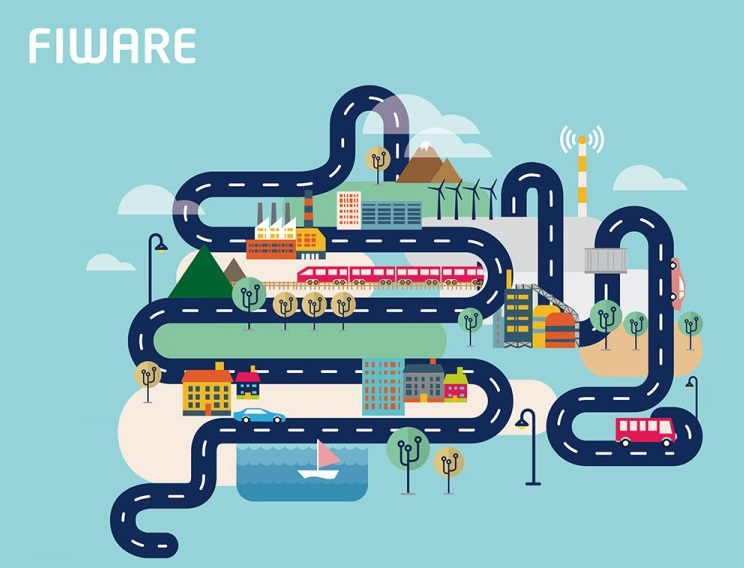

# Bienvenidos a FIWARE en Español
FIWARE es un ecosistema de innovación y emprendimiento abierto basado en las tecnologías del internet del futuro. Este ecosistema se está convirtiendo rápidamente en una plataforma base para el desarrollo de servicios inteligentes a nivel internacional. En este sitio encontrarás una guía completa donde podrás conocer paso a paso los conceptos básicos requeridos para desarrollar soluciones inteligentes basadas en la tecnología FIWARE.
Este guía fue desarrollada por el [Laboratorio Nacional de Internet del Futuro](http://lanif.infotec.mx/) en el marco de los proyectos [FIWARE Mexico](http://www.fiwaremexico.org/) y [SmartSDK](https://www.smartsdk.mx/).
  

