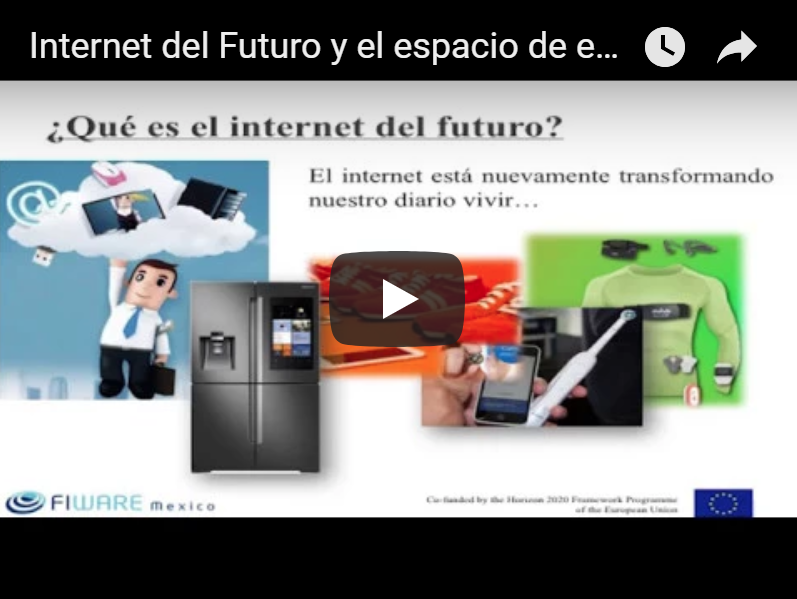
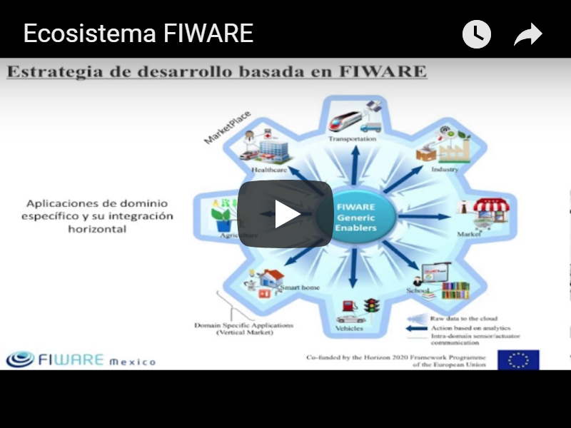
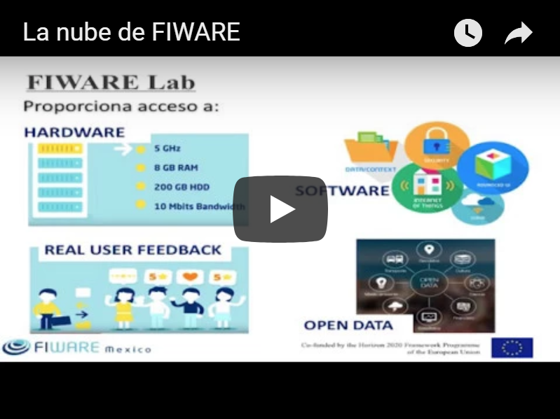
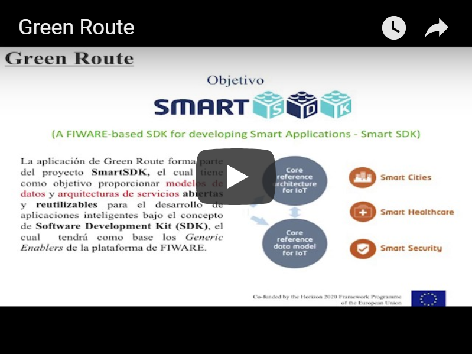
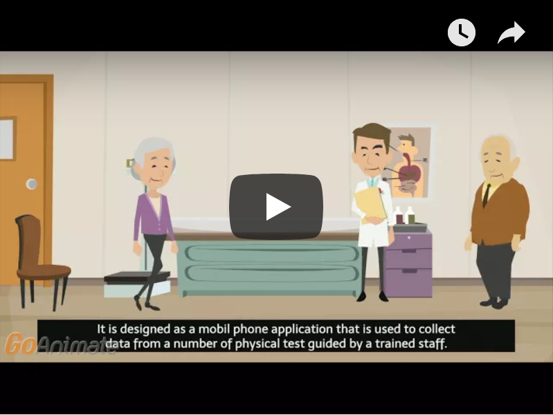
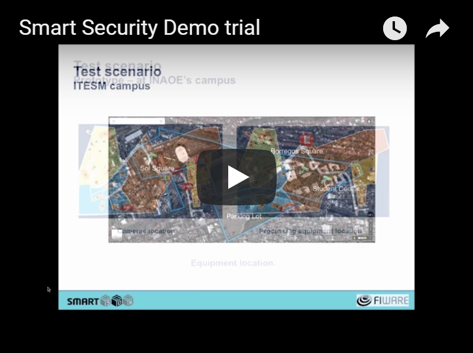
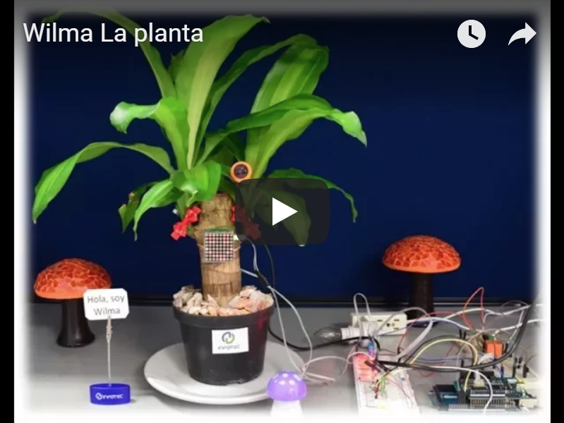
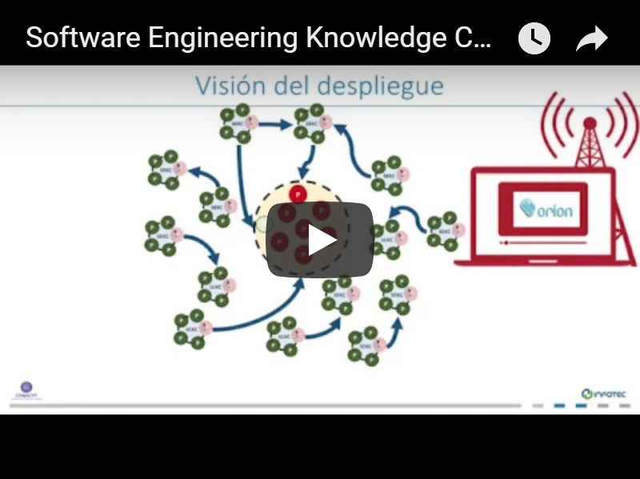
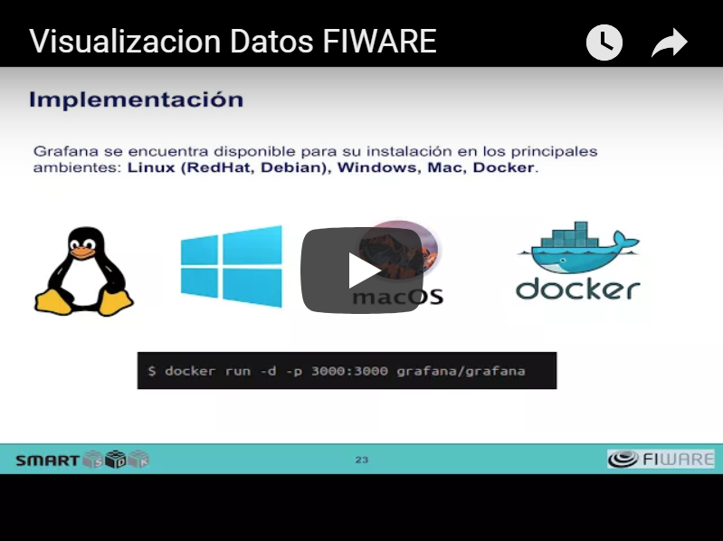

El ecosistema de innovación y emprendimiento abierto [FIWARE](https://www.fiware.org/about-us/) proporciona la **plataforma FIWARE** para el desarrollo de servicios y aplicaciones (comúnmente llamados soluciones inteligentes) cuya principal característica es que recolectan datos del entorno en el que se desenvuelven (son conscientes de su contexto), desde diferentes fuentes, como usuarios finales, redes de sensores y todo tipo de sistemas de información incluidas las redes sociales que posibilitan la toma de decisiones automáticas, generándose las acciones “adecuadas” al entorno en el que se desenvuelve la solución.
Esta plataforma se encuentra disponible para su uso en la **nube de FIWARE**, un entorno de experimentación, donde los usuarios pueden probar la tecnología y sus aplicaciones, aprovechando los datos abiertos publicados por las ciudades y otras organizaciones.

Además cuenta con otras iniciativas como un **programa de aceleración FIWARE**, **FIWARE Mundus** un programa de expansión de FIWARE a nivel mundial y **FIWARE iHubs** un programa de centros de innovación alrededor del mundo que contribuyan en la creación de comunidades de usuarios y contribuidores de FIWARE a nivel local.

  

# Videos introductorios a FIWARE

## Internet del Futuro y el espacio de experimentación LaNIF
En este video conocerás sobre el concepto de “Internet del futuro” con ejemplos de aplicaciones y servicios innovadores que se ofrecen a través de Internet. Se explica cuáles son las principales características de estas aplicaciones y servicios y se presenta el Laboratorio Nacional de Internet del Futuro, un espacio de experimentación donde podrás incursionar en el desarrollo de este tipo de soluciones a través del ecosistema de innovación y emprendimiento abierto FIWARE.

## Ecosistema FIWARE
En este video conocerás el ecosistema FIWARE, un ecosistema de emprendimiento abierto creado en Europa, que fomenta la innovación y el desarrollo de soluciones digitales. También aprenderás sobre los componentes de software abierto que FIWARE ofrece, su arquitectura y su estrategia de desarrollo. Así como ejemplos de aplicaciones basadas en FIWARE desarrolladas en Europa.

## La nube de FIWARE
En este video conocerás la nube de FIWARE, una nube basada en Openstack, desde donde podrás acceder a recursos de hardware, así como a los componentes de software de FIWARE para desarrollar fácilmente aplicaciones y servicios innovadores. También conocerás cómo acceder a esta nube a través de los diferentes tipos de cuenta.

## Green route – aplicación inteligente de movilidad 
En este video conocerás sobre la aplicación Green Route, desarrollada con FIWARE, la cual se centra en la movilidad de usuarios en ciudades con altos niveles de contaminación, como la Ciudad de México.

## Aplicación inteligente de salud 
En este video se presenta una aplicación de salud que utiliza teléfonos móviles y dispositivos electrónicos personales para obtener datos de comportamiento de usuarios e inferir información como parámetros clínicos y para crear bases de datos que pueden utilizarse en investigaciones sobre epidemias.    

 
## Aplicación inteligente de seguridad
En este video se presenta una aplicación de seguridad basado en un sistema de video vigilancia que detecta eventos de riesgo de manera automática.  

## Wilma la planta – aplicación de Internet de las Cosas
En este video a Wilma, un prototipo de Internet de las Cosas que consiste en una planta palo de Brasil conectada a la nube de FIWARE para comunicar su estatus a través de diferentes sensores.

## SEKC – aplicación de ingeniería de software
En este video se presenta una aplicación del dominio de la ingeniería de software que utiliza FIWARE para la adopción de las mejores prácticas para el desarrollo de software de alta calidad.

## Aplicación de visualización de datos
En este video se presenta una aplicación para visualización, análisis y monitoreo de datos obtenidos de FIWARE utilizando Grafana.

