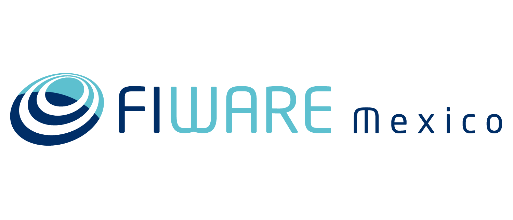
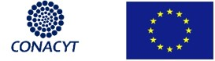

## FIWARE: La plataforma abierta para el futuro digital inteligente

La [plataforma FIWARE](https://www.fiware.org/about-us/) fue desarrollada por el programa europeo para el desarrollo de Internet del Futuro (FI-PPP), quien se planteó el objetivo de construir un ecosistema sostenible alrededor de estándares abiertos donde las oportunidades pueden ser capturadas por proveedores de aplicaciones y proveedores de plataformas. FIWARE proporciona un conjunto de componentes ofrecidos “como servicio” que facilitan el desarrollo de soluciones inteligentes en múltiples sectores verticales.

Las soluciones inteligentes tienen como principal característica que recolecta datos del entorno en el que se desenvuelve (son conscientes de su contexto), desde diferentes fuentes como usuarios finales, redes de sensores, aplicaciones móviles y todo tipo de sistemas de información como los sistemas CRM y las redes sociales. Esta información de contexto es analizada de manera que permitan la toma de decisiones automáticas, generándose las acciones “adecuadas” al entorno en el que se desenvuelve la solución.

Para recopilar y administrar información de contexto, FIWARE cuenta con un componente central llamado Context Broker, a través del cual se interactúa con otras plataformas o aplicaciones utilizando la API restful FIWARE NGSI. Ésta API es abierta y estandar, por lo que ofrece a los desarrolladores, la capacidad de portar sus aplicaciones a través de diferentes plataformas desarrolladas también con FIWARE y un marco estable para futuros desarrollos. Por otro lado, es posible agregar funcionalidades adicionales mediante el uso de otros componentes de FIWARE o componentes de terceros, para lo que la integración con el Context Broker está resuelta. Esta integración se simplifica ya que todos los componentes se basan en la interfaz estándar de FIWARE NGSI. 

La naturaleza basada en componentes de una solución basada en FIWARE permite extender la arquitectura de una solución, a medida que ésta evoluciona de acuerdo a las necesidades del negocio.

Además del Context Broker, FIWARE cuenta con otros componetes que permiten que el Internet de las Cosas sea más simple al establecer interfaces que facilitan la conexión con dispositivos físicos, permiten transformar los grandes cúmulos de información en conocimiento, permiten desencadenar el potencial de datos abiertos en tiempo real, entre otras cosas. 

De esta manera FIWARE se enfoca en romper los silos de información mediante el establecimiento de estándares, habilitando la economía de datos y garantizando su soberanía. 

Los componentes de FIWARE estan disponibles para su descarga y para su uso en la **[nube de FIWARE](https://cloud.lab.fiware.org)**, un entorno de experimentación, donde los usuarios pueden probar la tecnología y sus aplicaciones, aprovechando los datos abiertos publicados por ciudades y otras organizaciones.

FIWARE, además de ser una plataforma abierta, cuenta con otras iniciativas que impulsan su uso a nivel internacional, como un **programa de aceleración FIWARE**, que ofrece financiamiento para el desarrollo de proyectos con FIWARE en paises europeos, **FIWARE Mundus** un programa de expansión de FIWARE a nivel mundial y **FIWARE iHubs** un programa de centros de innovación alrededor del mundo que contribuyan en la creación de comunidades de usuarios y contribuidores de FIWARE a nivel local.

## FIWARE en México
En el año 2014 se creó el Laboratorio Nacional del Internet del Futuro (LaNIF), una infraestructura de cómputo de alto desempeño para experimentación y comercialización de las tecnologías básicas para la siguiente generación de internet: internet de las cosas, cómputo en la nube y análisis de grandes cúmulos de información. La infraestructura del LaNIF está basada en los componentes de FIWARE y forma parte de la nube de FIWARE, siendo reconocido como el nodo FIWARE Lab de México.

Por medio del LaNIF, México cuenta con los recursos de hardware y software para que sus usuarios prueben la tecnología y sus aplicaciones haciendo uso de infraestructura de cómputo como servicio (máquinas virtuales, espacio de almacenamiento, servicios de red), de los componentes de software de la Plataforma FIWARE y de los datos abiertos disponibles en la nube, que son publicados por ciudades y otras organizaciones.

Este sitio fue creado con la finalidad de facilitar el acceso al conocimiento que se requiere para iniciar a desarrollar con FIWARE. Forma parte del proyecto [FIWARE México](http://www.fiwaremexico.org/), el cual cuenta con un programa de capacitación en FIWARE que busca crecer la comunidad de FIWARE en México creando capacidades técnicas para el desarrollo de aplicaciones inteligentes (puedes conocer más sobre el proyecto en la sección ["Sobre nosotros"](./FIWAREMexico//sobrenosotros.md)).  

Aquí encontrarás material para aprender a desarrollar tus aplicaciones inteligentes utilizando FIWARE. Encontrarás manuales para crear tu primera aplicación con FIWARE, para construir un dispositivo de Internet de las Cosas que se comunique con FIWARE utilizando la tecnología [Cloudino](http://cloudino.io/), para obtener una cuenta en la nube de FIWARE, entre otros. 

##  
**El proyecto FIWARE México es cofinanciado por el programa marco Horizonte 2020 de la Unión Europea y el Consejo Nacional de Ciencia y Tecnologia (CONACYT).**

  
