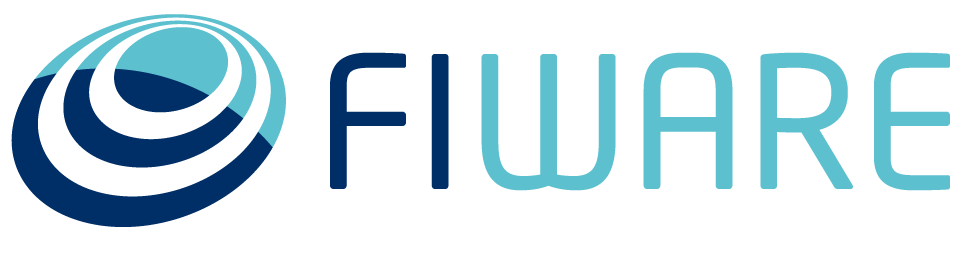

El ecosistema de innovación y emprendimiento abierto [FIWARE](https://www.fiware.org/about-us/) proporciona la **plataforma FIWARE** para el desarrollo de servicios y aplicaciones (comúnmente llamados soluciones inteligentes) cuya principal característica es que recolectan datos del entorno en el que se desenvuelven (son conscientes de su contexto), desde diferentes fuentes, como usuarios finales, redes de sensores y todo tipo de sistemas de información incluidas las redes sociales que posibilitan la toma de decisiones automáticas, generándose las acciones “adecuadas” al entorno en el que se desenvuelve la solución.
Esta plataforma se encuentra disponible para su uso en la **nube de FIWARE**, un entorno de experimentación, donde los usuarios pueden probar la tecnología y sus aplicaciones, aprovechando los datos abiertos publicados por las ciudades y otras organizaciones.

Además cuenta con otras iniciativas como un **programa de aceleración FIWARE**, **FIWARE Mundus** un programa de expansión de FIWARE a nivel mundial y **FIWARE iHubs** un programa de centros de innovación alrededor del mundo que contribuyan en la creación de comunidades de usuarios y contribuidores de FIWARE a nivel local.

  

