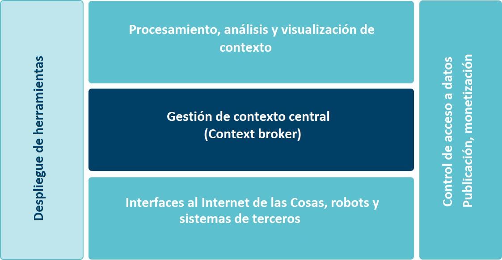

## FIWARE: La plataforma abierta para el futuro digital inteligente

[FIWARE](https://www.fiware.org/about-us/) es un marco de componentes de plataforma de código abierto que se puede ensamblar junto con otros componentes de plataforma de terceros para acelerar el desarrollo de soluciones inteligentes.

Una solución inteligente tiene como principal característica, que recolecta datos del entorno en el que se desenvuelve (son conscientes de su contexto), desde diferentes fuentes como usuarios finales, redes de sensores, aplicaciones móviles y todo tipo de sistemas de información como los sistemas CRM y las redes sociales. Esta información de contexto es analizada de manera que permitan la toma de decisiones automáticas, generándose las acciones “adecuadas” al entorno en el que se desenvuelve la solución.

Para recopilar y administrar información de contexto, FIWARE cuenta con un componente central llamado Context Broker, rodeado por una suite de componentes de plataforma adicionales, que permiten suministrar datos de contexto de diversas fuentes y brindan soporte para el procesamiento, análisis y visualización de datos, así como para control de acceso a datos, publicación o monetización.

 

Los componentes de plataforma estan disponibles para su descarga y también estan disponibles para su uso en la **[nube de FIWARE](https://cloud.lab.fiware.org)**, un entorno de experimentación, donde los usuarios pueden probar la tecnología y sus aplicaciones, aprovechando los datos abiertos publicados por las ciudades y otras organizaciones.

Además cuenta con otras iniciativas como un **programa de aceleración FIWARE**, **FIWARE Mundus** un programa de expansión de FIWARE a nivel mundial y **FIWARE iHubs** un programa de centros de innovación alrededor del mundo que contribuyan en la creación de comunidades de usuarios y contribuidores de FIWARE a nivel local.

## 
Este sitio fue creado con la finalidad de facilitar el acceso al conocimiento que se requiere para iniciar a desarrollar con FIWARE. Forma parte del proyecto [FIWARE México](http://www.fiwaremexico.org/), el cual cuenta con un programa de capacitación en FIWARE que busca crecer la comunidad de FIWARE en México creando capacidades técnicas para el desarrollo de aplicaciones inteligentes (puedes conocer más sobre el proyecto en la sección ["Sobre nosotros"](./FIWAREMexico//sobrenosotros.md)).  

Aquí encontrarás material para aprender a desarrollar tus aplicaciones inteligentes utilizando FIWARE. Encontrarás manuales para crear tu primera aplicación con FIWARE, para construir un dispositivo de Internet de las Cosas que se comunique con FIWARE utilizando la tecnología [Cloudino](http://cloudino.io/), para obtener una cuenta en la nube de FIWARE, entre otros. 

##  
**El proyecto FIWARE México es cofinanciado por el programa marco Horizonte 2020 de la Unión Europea y el Consejo Nacional de Ciencia y Tecnologia (CONACYT).**

  
