# Creación de una unidad de monitoreo con Cloudino

## Introducción 

Esta guía proporciona la información necesaria para crear una unidad de monitoreo de calidad del aire utilizando Cloudino, un agente de Internet de las Cosas, que permite monitorear sensores de manera remota y enviar datos a la plataforma FIWARE. 
El conector WiFi de Cloudino (Cloudino WiFi Connector) puede ser utilizado como un dispositivo independiente para comunicar objetos de la vida real directamente a internet o como un microcontrolador adicional dedicado a la capa de red, trabajando en paralelo con soluciones de microcontroladores actuales como Arduino.


## Qué se necesita

Utilizando Arduino, el conector WiFi de Cloudino funciona como otro procesador en paralelo dedicado solamente a la capa de red, incluyendo los protocolos de Internet de las Cosas, dejando al Arduino dedicado a la conectividad con sensores y actuadores y permitiendo reprogramar al Arduino vía WiFi o a través de la Nube. 
De esta manera, podemos conectar cualquier sensor compatible con Arduino y procesar los datos a través de Cloudino y la plataforma FIWARE. 
Para el propósito de esta guía, utilizaremos los siguientes componentes:

* [Cloudino WiFi Connector (CWC)](http://cloudino.io).
* [Arduino UNO](https://store.arduino.cc/usa/arduino-uno-rev3).
* [PPD42NS](https://www.mouser.com/ds/2/744/Seeed_101020012-1217636.pdf). Sensor PM10.
* [DHT11](http://www.micropik.com/PDF/dht11.pdf). Sensor de temperatura / Humedad.
* [MQ-131](https://www.compel.ru/item-pdf/cf02de305c8369719f27e4149395c6da/pn/winsen~mq131-high-concentration-ozone-gas-sensor.pdf).
  Sensor de Ozono.
* [Grove Multichannel](http://cdn-reichelt.de/documents/datenblatt/A300/101020088_01.pdf).
  Sensor de gas (NO2, CO).

Estos componentes se pueden adquirir en alguna tienda de electrónica local o en línea. A continuación, presentamos algunas opciones: 

* <https://www.robotshop.com/>
* <https://www.seeedstudio.com/>
* <https://www.sainsmart.com/>
* <https://store.arduino.cc/usa/arduino-uno-rev3>
* <https://www.sparkfun.com/products/13678>

El conector WiFi de Cloudino puede ser adquirido directamente contactando a su desarrollador 
<javier.solis@infotec.mx>, <victor.hernandez@infotec.mx>
o puede construir su propio conector utilizando un dispositivo [ESP8266](https://www.sparkfun.com/products/13678)
y siguiendo las instrucciones de la [documentación de Cloudino](https://github.com/Cloudino/Cloudino-Doc/wiki/Make-your-first-Cloudino).

## Modelo de conexión de la unidad de monitoreo

Fig. 1 muestra el modelo de conexión para una unidad de monitoreo de calidad del aire donde la placa de Arduino Uno conecta cuatro sensores, los cuales miden: temperatura, humedad, monóxido de carbono (CO), óxido de nitrógeno (NO2) y partículas de polvo (PM10), además conecta el conector WiFi de Cloudino que permite enviar las mediciones de los sensores a la nube utilizando el portal
[cloudino.io](http://cloudino.io/).

  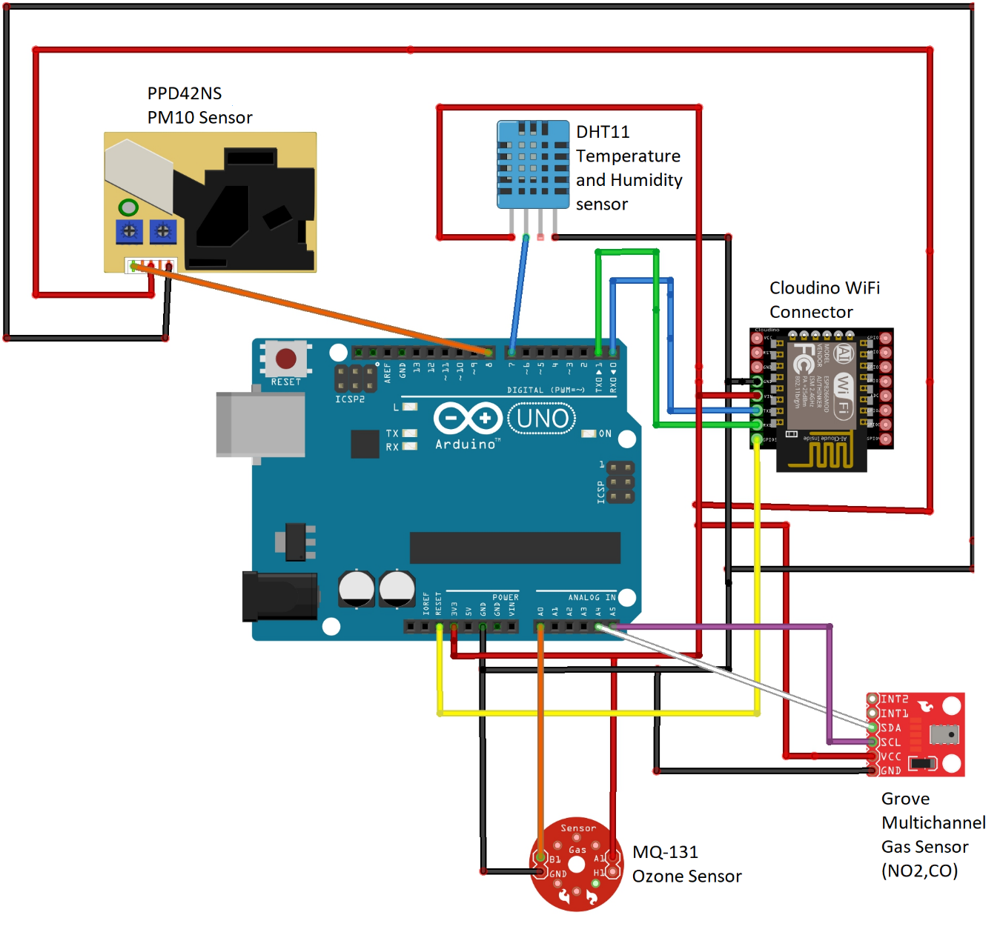
  *Fig. 1. Diagrama de la unidad de monitoreo de calidad del aire*

El esquema es propuesto con fines educativos y sus componentes son fáciles de conseguir. Sin embargo, es posible integrar algún componente electrónico adicional que se desee a la placa de Arduino para crear sistemas más complejos y de esta manera publicar sus datos en las plataformas de Cloudino y FIWARE. 

## Instalación y configuración

### Crear un ambiente de desarrollo en Cloudino.io

Para utilizar la plataforma de Cloudino, es necesario ingresar al portal
[cloudino.io](http://cloudino.io/) donde se encuentran las herramientas que nos permitirán conectar cualquier dispositivo al Internet de las Cosas. 

  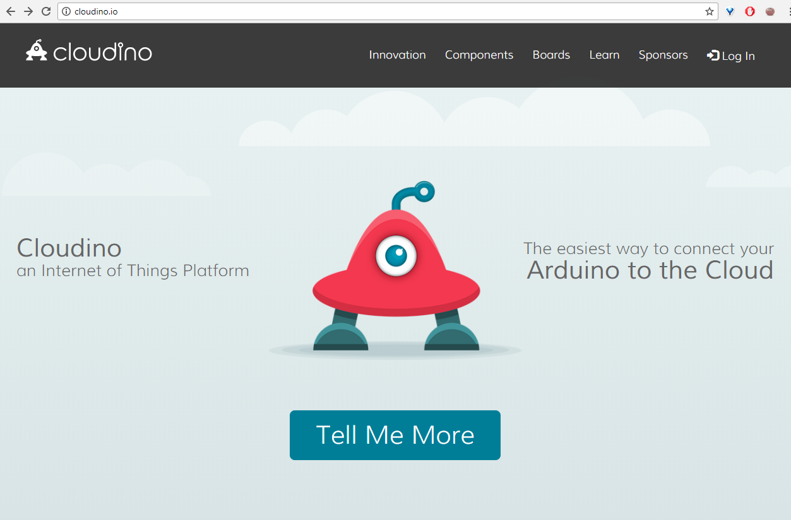
  *Fig. 2. Portal cloudino.io*

En primer lugar, se requiere crear una cuenta e iniciar sesión en la plataforma, donde encontrará una sección de configuración para gestionar los dispositivos Cloudino, conexiones al [FIWARE Orion Context Broker (OCB)](https://fiware-orion.readthedocs.io), así como una guía de inicio. 

  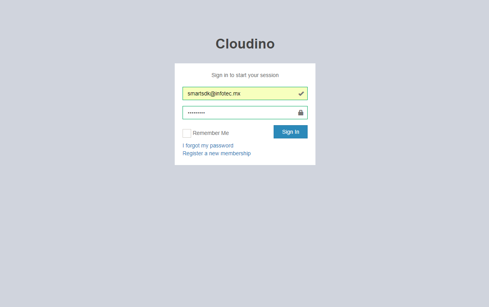
  *Fig. 3. Página de inicio de sesión*

  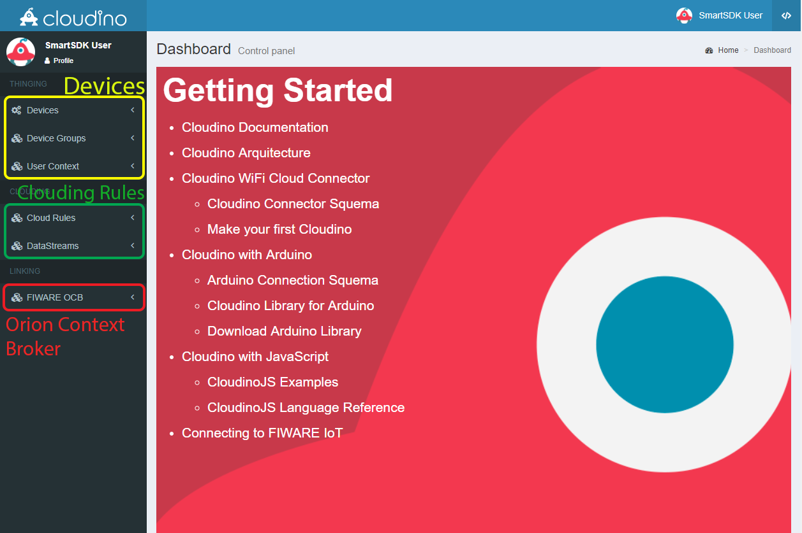
  *Fig. 4. Página de inicio de cloudino.io después de iniciar sesión*

El conector WiFi de Cloudino debe configurarse desde el portal para conectar su unidad de monitoreo de calidad del aire a la plataforma de Cloudino. Para ello registraremos un dispositivo en el portal. 

  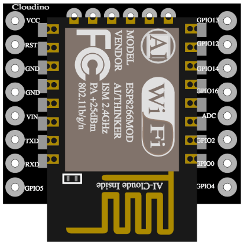
  *Fig. 5. Conector WiFi de Cloudino*

Del lado izquierdo del panel, seleccione el menú "Devices" y haga clic en la opción "Add Device". 
Introduzca un nombre, descripción y tipo de hardware. En este caso, utilizaremos un Arduino Uno. Haga clic en "Submit" para dar de alta el dispositivo. Se puede registrar la cantidad de dispositivos que se desee. 

  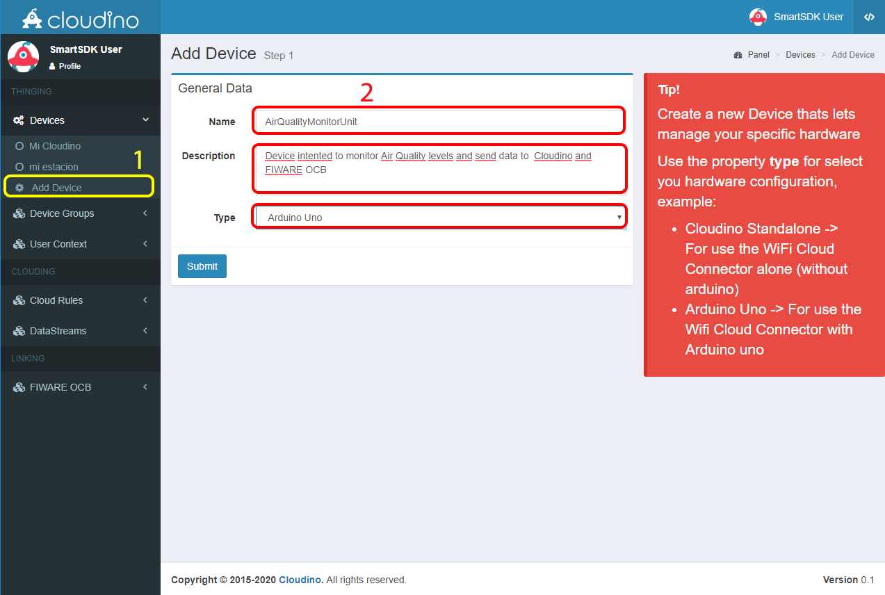
  *Fig. 6. Registro del conector WiFi de Cloudino en cloudino.io*

Después del registro del dispositivo, se mostrarán varias secciones que permitirán configurarlo, controlarlo y programarlo. Así como asociarlo a nuestro conector WiFi de Cloudino, como se ve en la Fig. 7.

  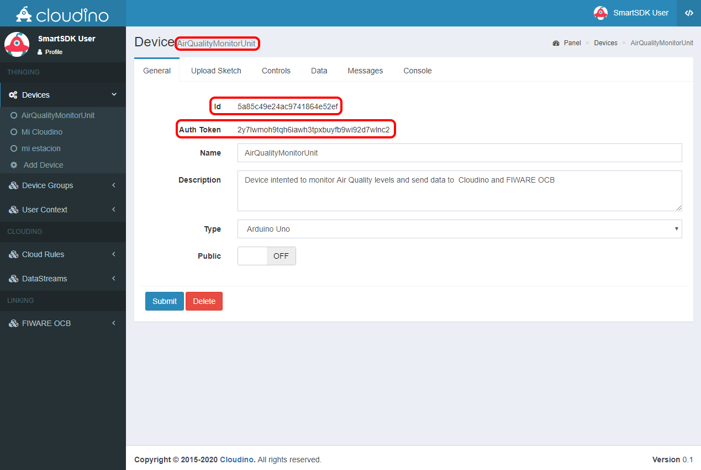
  *Fig. 7. Información general del conector WiFi de Cloudino*

La vista "General" muestra el identificador del dispositivo (id), el token de autenticación (Auth Token), nombre (name), descripción (description), tipo (type) y el nivel de seguridad público o privado (public/private). Esta información será utilizada posteriormente para asociar nuestro conector WiFi de Cloudino al dispositivo creado en el portal. 

### Conectar un conector WiFi de Cloudino al portal de cloudino.io

Una vez que se ha registrado un dispositivo en el portal de cloudino.io, se requiere asociarlo con el conector WiFi de Cloudino adjuntando el token de autenticación generado en el paso anterior. De esta manera, nuestra unidad de calidad del aire se conectará a la plataforma Cloudino. 
Para llevar a cabo esta acción, conecte el conector WiFi de Cloudino a una fuente de alimentación (5 volts). Al conectarlo, se creará una red WiFi a la cual debemos conectarnos para acceder al panel de configuración del conector WiFi de Cloudino. **El SSID de la red WiFi es el número de serie del conector WiFi de Cloudino y se crea sin contraseña**. 
Por ejemplo, Fig. 8 muestra la red Cloudino_FAAE37 que es la que utilizaremos para configurar nuestro conector WiFi de Cloudino, el cual tiene el número de serie FAAE37. 

  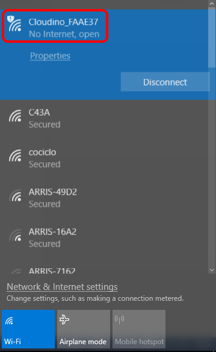
  *Fig. 8. Red WiFi creada por un conector WiFi de Cloudino*

Una vez que nos conectamos a la red WiFi de nuestro conector (en este caso Cloudino_FAAE37), nos aparecerá un panel de configuración. En caso de que esto no suceda, puede acceder al panel utilizando un navegador web con la dirección IP **192.168.4.1**. Fig. 9 muestra la página web de un conector WiFi de Cloudino donde se realiza su configuración.

  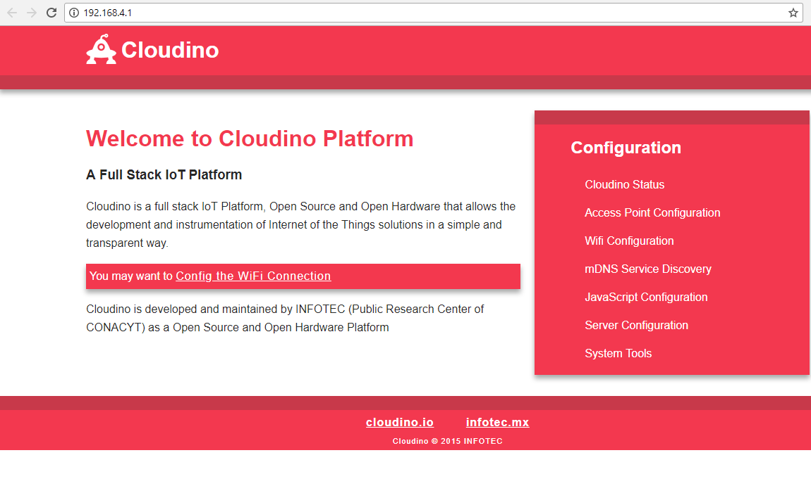
  *Fig. 9. Panel de configuración del conector WiFi de Cloudino en la IP 192.168.4.1*

La asociación se realiza accediendo a la opción "Cloudino Cloud Configuration" que se encuentra en el submenú "Server Configuration" / "Cloudino Server". Para ello se requiere copiar y pegar el token de autenticación (Auth Token) en el campo "Auth Token" y seleccionar la opción "True" en el campo "Active". Posteriormente haga clic en el botón "Save", como se muestra en la  Fig 10.

  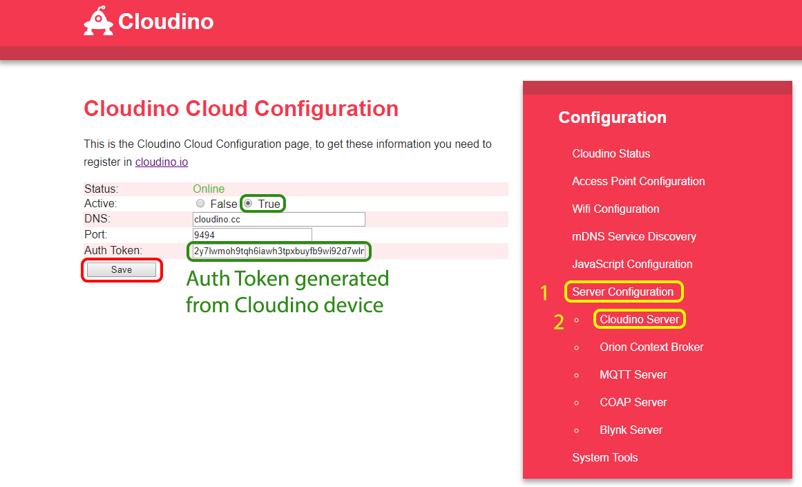
  *Fig. 10. Configuración del conector WiFi de Cloudino*

Por último, se debe configurar el conector WiFi de Cloudino para tener acceso a internet a través de una red WiFi para que envíe datos a la plataforma Cloudino. Para ello, vaya al menú "WiFi Configuration", escanee las redes WiFi disponibles y conéctese a la que desee. Puede verificar si la conexión es correcta cuando el estatus (Status) cambie a **"CONNECTED"**, como se muestra en la  Fig 11. 

  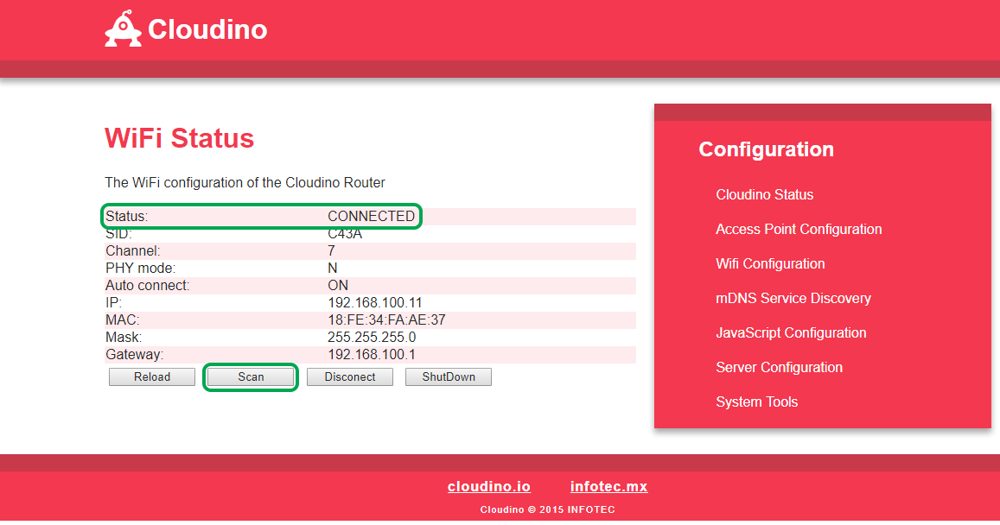
  *Fig. 11. Configuración de la red WiFi.*

La conexión entre su conector WiFi de Cloudino y [cloudino.io](http://cloudino.io/) se establece cuando al campo “Active” se le asigna el valor “True” como se especificó en pasos anteriores. 

### Verificar la conexión entre el conector WiFi de Cloudino y cloudino.io

Para comprobar si el conector WiFi de Cloudino está conectado con la plataforma de Cloudino, se requiere que inicie sesión nuevamente en el portal de cloudino.io y seleccionar el menú "Devices". 

Si la conexión se estableció adecuadamente, podrá observar la leyenda **"online"** en color verde a un lado su dispositivo creado previamente, como se aprecia en la Fig. 12.
***Tenga en cuenta que debió desconectar su computadora de la red WiFi de su conector WiFi de Cloudino y conectarse a una red WiFi de acceso a internet.***

En este punto, su unidad de monitoreo de calidad del aire está lista para ser programada y controlada por medio de las herramientas de [cloudino.io](http://cloudino.io/).

  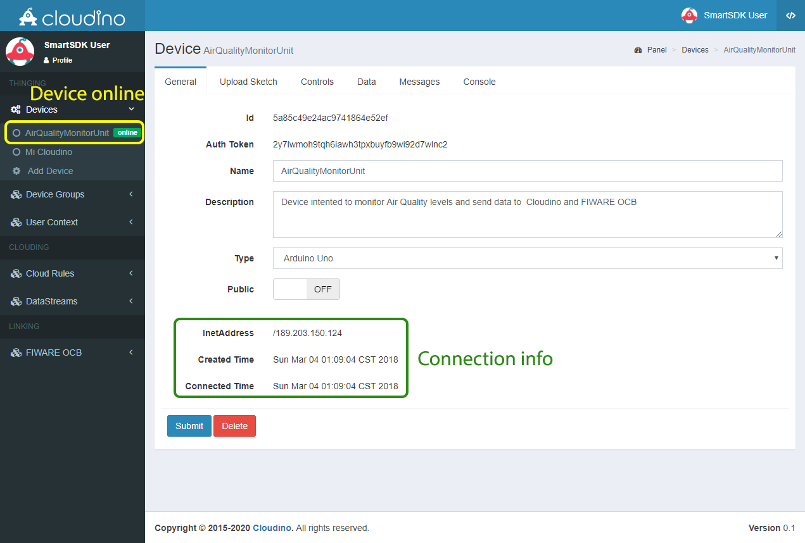
  *Fig. 12. El dispositivo está en línea y listo para usarse.*

### Definición de la lógica de la aplicación a través de las herramientas de desarrollo de cloudino.io

Una vez realizada la configuración del conector WiFi de Cloudino, podemos proceder a su programación con el hardware asociado "Arduino Uno" y los sensores (vea la Fig. 1. Diagrama de la unidad de monitoreo de calidad del aire), para definir el comportamiento de la aplicación de monitoreo de la calidad del aire. 

En primer lugar, se requiere crear un "sketch" (un programa usado para controlar una placa Arduino), el cual tiene el mismo contexto y significado que en la tecnología Arduino. Para ello, haga clic en la sección **"Arduino"** del menú desplegable del lado superior derecho que se indica con el icono </> y acceda a **"Sketchers"**, donde puede crear o editar proyectos para usar en las placas Arduino con la tecnología Cloudino. Seleccione la opción **"Add Sketcher"** como se muestra en la Fig. 13.

  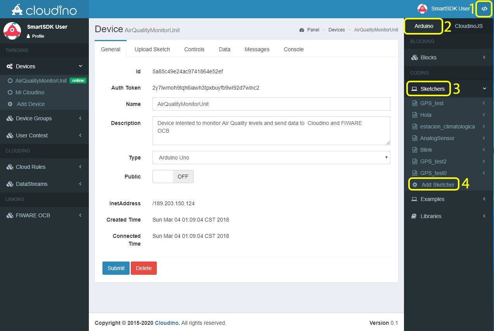
  *Fig. 13. Opción para agregar un "Sketch" en el menu de Arduino*

Ya que se encuentra en la opción "Add Sketcher", ingrese un nombre para su "Sketch" y presione el botón "Submit" (Figs. 14).  

  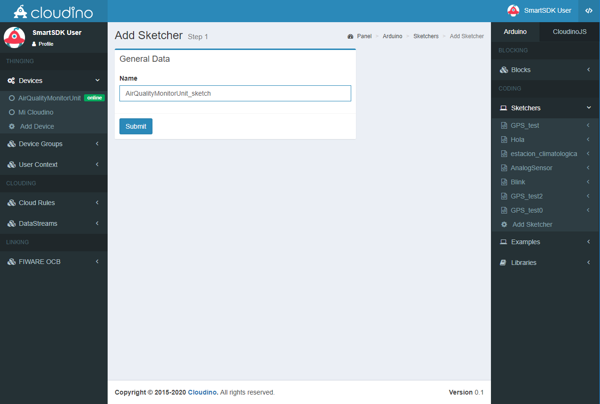
  *Fig. 14. Definir el nombre del Sketch*

Posteriormente, se mostrará el área de codificación del "Sketch" como se muestra en la Fig. 15.

  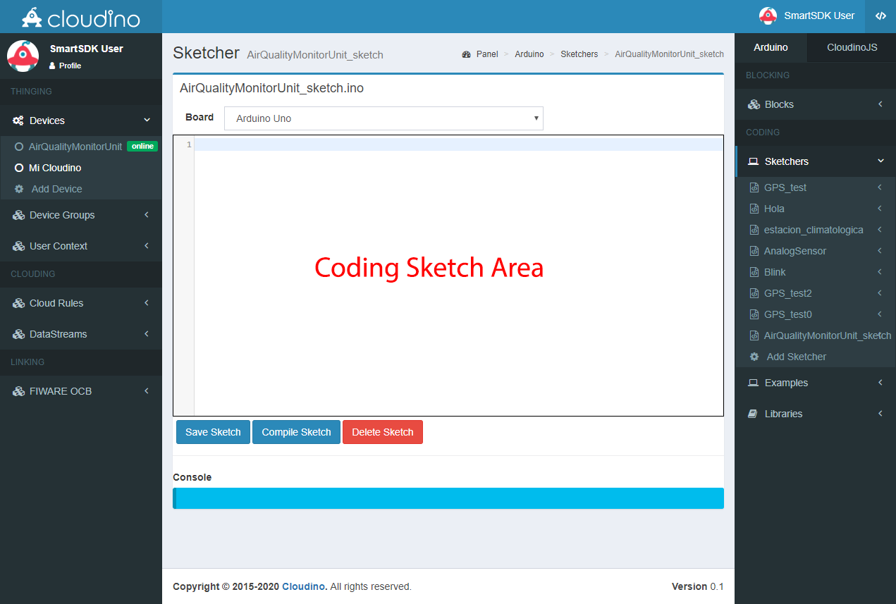
  *Fig. 15. Área de codificación del "Sketch"*
  
En el área de codificación del "Sketch" puede escribir el código para controlar el Arduino, el conector WiFi de Cloudino y los sensores para el monitoreo remoto de su unidad de monitoreo de la calidad del aire.

La sintaxis del código se basa en la API (Interfaz de programación de aplicaciones) de Cloudino que es una variante de Arduino, lo que facilita la adopción por parte de antiguos y nuevos usuarios de Arduino. Se puede encontrar una descripción amplia de la API de Cloudino en https://github.com/Cloudino/Cloudino-Doc.

A continuación se puede ver el código Arduino que se utilizará en el desarrollo de nuestra unidad de monitoreo de la calidad del aire. El código envía los valores brutos capturados desde los sensores de la unidad de monitoreo de calidad del aire a la plataforma Cloudino usando un método de publicación.

```c++
#include <Cloudino.h>
#include <dht11.h>
#define DHT11PIN 7

Cloudino cdino;
dht11 DHT11;

const int analogPinO3 = A0;
const int analogPinCO = A3;
const int analogPinNO2 = A4;

void setup()
{
  cdino.setInterval(10000,getSensors);
  cdino.begin();
}

void getSensors()
{
   int chk = DHT11.read(DHT11PIN);
   cdino.post("temperature",String((float)DHT11.temperature,2));
   cdino.post("relativeHumidity",String((float)DHT11.humidity,2));
   cdino.post("O3",String(analogRead(analogPinO3)));
   cdino.post("CO",String(analogRead(analogPinCO)));
   cdino.post("NO2",String(analogRead(analogPinNO2)));
   cdino.post("PM10",String(digitalRead(8)));
}

void loop()
{
   cdino.loop();
}
```
***El código anterior captura los datos brutos de los sensores, excepto el DHT11, que hace uso de su propia biblioteca para calcular la temperatura y la humedad relativa correctas. Para representar correctamente las mediciones de muchos sensores, es posible que se necesiten bibliotecas adicionales.***

Una vez que se ha escrito el código para el "sketch", se debe guardar y compilar para verificar que sea consistente con la API de Cloudino. Este proceso se realiza haciendo clic en el botón "Compile" como se muestra en la Fig. 16. El cuadro azul (Console) muestra el estado de la compilación, donde podrá ver si se presentó algún error o se realizó con éxito. Consultar la API de Cloudino en el [sitio web de Cloudino](https://github.com/Cloudino/Cloudino-Doc), para resolver cualquier problema de compilación. 

  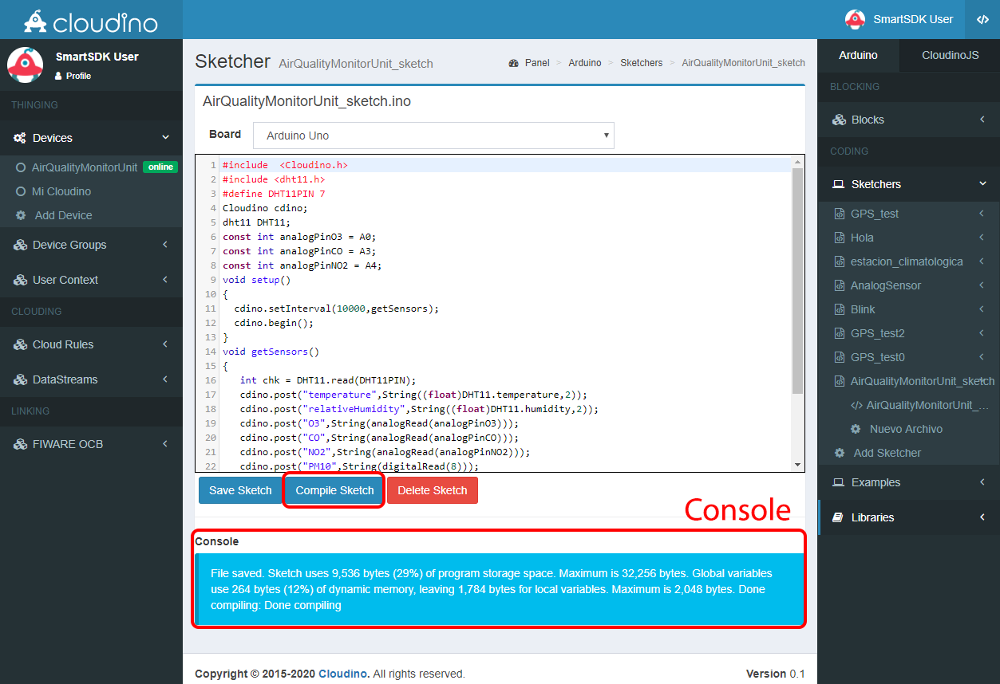
  *Fig 16. Sketch compilado con éxito*

Ahora, cargaremos el "Sketch" en el dispositivo asociado a nuestra unidad de monitoreo. Para ello, haga clic en la sección "Upload Sketch" (Fig. 17).

  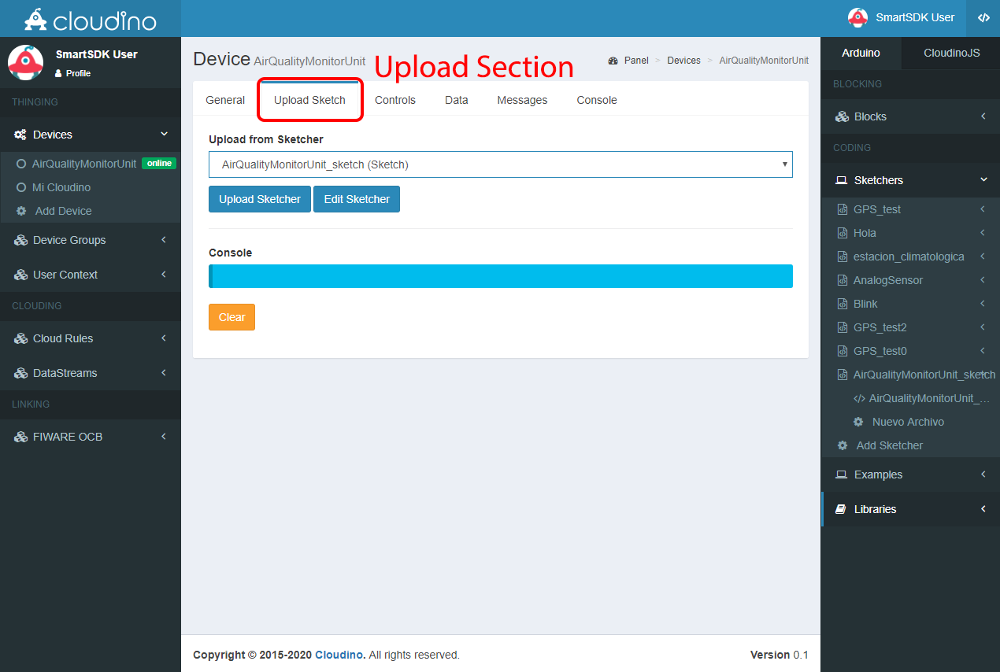
  *Fig. 17. Sección "Upload Sketch"*

En el campo "Upload from Sketcher" se despliega una lista de los "sketch´s" existentes en la plataforma, incluyendo ejemplos y los desarrollados por el usuario de la sesión. Seleccione el "Sketch" que acaba de crear (en este ejemplo lo llamamos "AirQualityMonitorUnit_sketch") como se muestra en la Fig. 18.

Una vez seleccionado, presione el botón "Upload Sketcher" para flashear el código compilado en la memoria del Arduino y el conector WiFi de Cloudino. La lógica de la aplicación es almacenada después de que este proceso concluya con éxito. Las figuras 18 y 19 muestran este proceso. 

  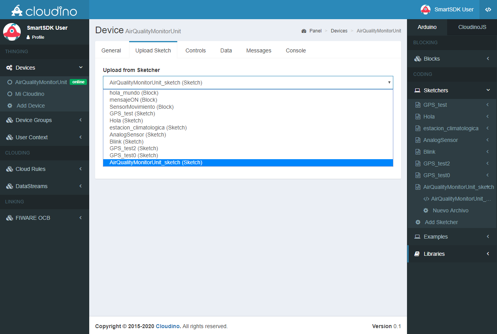
  *Fig. 18. Selección de un Sketch para cargarlo al dispositivo*

  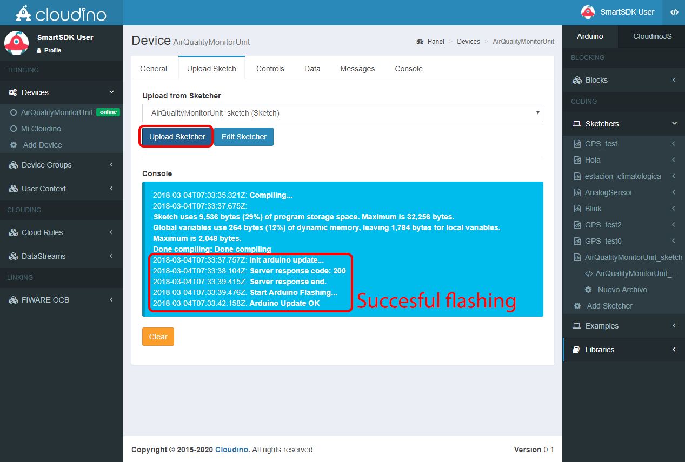
  *Fig. 19. Proceso de carga del Sketch al conector WiFi de Cloudino*

En este punto, la unidad de monitoreo está funcionando. Mientras esté conectada a una fuente de alimentación y conectada a internet, podrá enviar las mediciones de los sensores al servidor cloudino.io; por lo tanto, los datos se pueden observar y usar de forma remota. 

El código desarrollado envía periódicamente los valores obtenidos por los sensores cada segundo y los muestra en la sección **"Messages"** de la plataforma cloudino.io, como se muestra en la Fig. 20. La consola se actualiza en tiempo real indefinidamente mientras Cloudino está funcionando.

  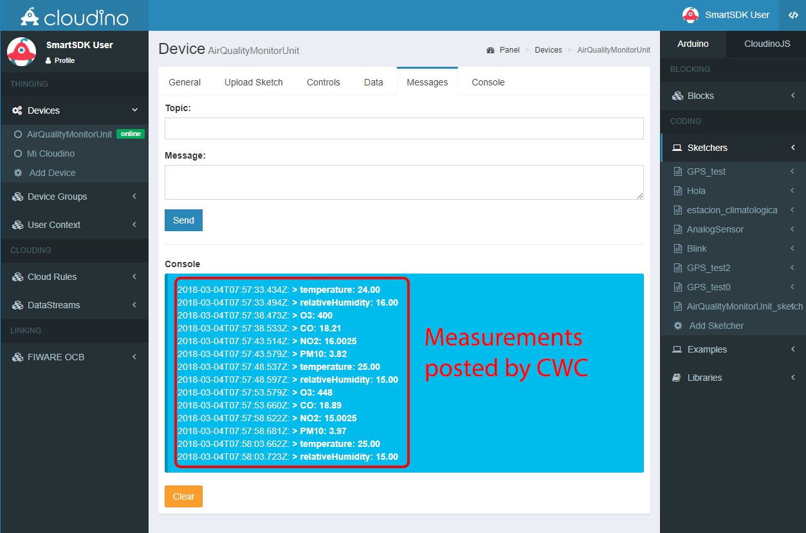
  *Fig. 20. Mediciones en tiempo real de la unidad de monitoreo de la calidad del aire*

## Cloudino como agente IoT de FIWARE

Cloudino funciona como un agente IoT capaz de trabajar con FIWARE. Su plataforma Cloudino nos permite conectarnos a un Orion Context Broker (OCB) de FIWARE siguiendo unos pasos sencillos. 

Para compartir los datos de su unidad de monitoreo de calidad del aire con la plataforma FIWARE, primero debe ingresar al menú **"FIWARE OCB"** que se encuentra en la parte inferior izquierda y seleccionar la opción **"Add Entity"**. Esta sección lo ayuda a definir un enlace con la plataforma FIWARE. Como se muestra en la Fig. 21, es necesario definir un nombre para el enlace, una descripción y seleccionar un dispositivo (el connector WiFi de Cloudino registrado en cloudino.io) para asociarlo con la plataforma. De esta manera, los datos recopilados por Cloudino se pueden compartir con la plataforma FIWARE.

  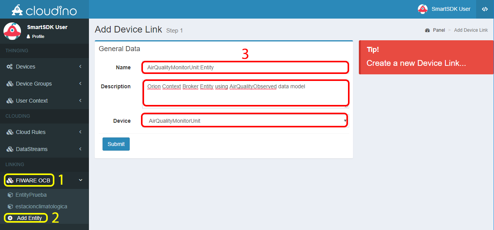
  *Fig. 21. Creación de un enlace de Cloudino con la plataforma FIWARE*
  
Una vez que el enlace ha sido creado, se despliega un panel de configuración, donde puede activar o desactivar el enlace, definir una entidad (FIWARE entity), la cual se compartirá en la plataforma FIWARE, así como especificar la dirección del servidor del Orion Context Broker que se utilizará para enviar los datos (en este caso nuestro servidor se encuentra en la dirección IP http://207.249.127.132:1026) y, cuando se requiera, los datos de autenticación necesarios para conectar al servidor.   

La Fig. 22 muestra la definición de la entidad “AirQualityMonitorUnit:Entity” que incluye todos los datos a obtener de los sensores de su unidad de monitoreo de calidad del aire. 

  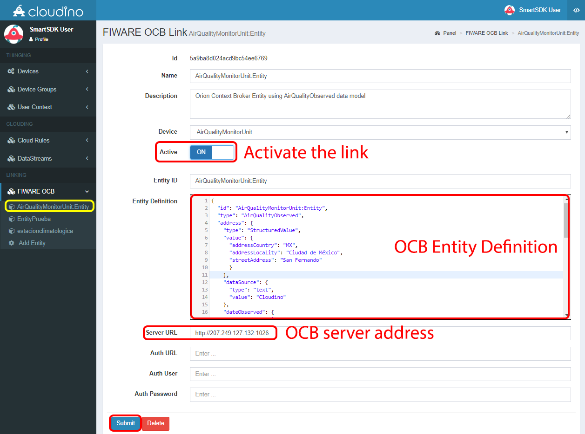
  *Fig. 22. Panel de configuración del enlace con la plataforma FIWARE*

El siguiente código JSON describe la entidad “AirQualityMonitorUnit:Entity” creada en el paso anterior. 

```json
{
  "id": "AirQualityMonitorUnit:Entity",
  "type": "AirQualityObserved",
  "address": {
    "type": "StructuredValue",
    "value": {
      "addressCountry": "MX",
      "addressLocality": "Ciudad de México",
      "streetAddress": "San Fernando"
      }
    },
    "dataSource": {
      "type": "text",
      "value": "Cloudino"
    },
    "dateObserved": {
      "type": "DateTime",
      "value": "2018-02-01T17:00:00-05:00"
    },
    "location": {
      "value": {
        "type": "Point",
        "coordinates": [-99.163309, 19.291001]
      },
      "type": "geo:json"
    },
    "temperature": {
      "type": "text",
      "value": "12.2"
    },
    "relativeHumidity": {
      "type": "text",
      "value": "0.54"
    },
    "O3": {
      "type": "number",
      "value": "1.6"
    },
    "CO": {
      "type": "number",
      "value": "1.7"
    },
    "NO2": {
      "type": "number",
      "value": "1.9"
    },
    "PM10": {
      "type": "number",
      "value": "3.5"
    }
  }
```

***Es importante observar que los nombres de las variables utilizadas en Cloudino deben ser iguales a los nombres definidos en los atributos del modelo de entidad FIWARE***.

Después de configurar el enlace, debe cambiar la opción **"Active"** a **"ON"** y definir la entidad (código JSON anterior) para compartirla con FIWARE, luego haga clic en el botón "Submit". Automáticamente comenzará a enviar los datos de la unidad de monitoreo de la calidad del aire al Orion Context Broker de FIWARE.

Para verificar la operación, podemos acceder al servidor del Orion Context Broker asociado (en este caso http://207.249.127.132:1026/v2) sin autenticación. La Fig. 23 muestra cómo los datos definidos en la entidad y asociado con el Cloudino, se despliegan y actualizan en tiempo real en el servidor del Orion Context Broker. 

  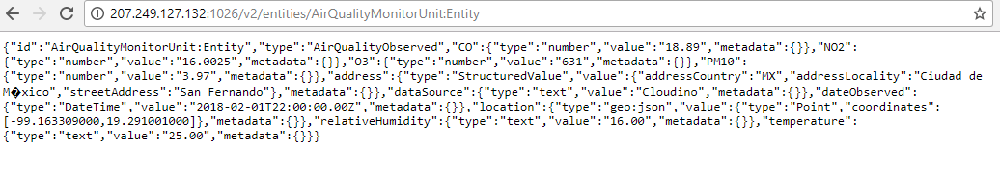
  *Fig. 23. Datos de la unidad de monitoreo en el servidor OCB de FIWARE*

Como puede verse en la Fig. 23, los datos de la unidad de monitoreo de la calidad del aire pueden consultarse utilizando la siguiente llamada REST: 

<http://207.249.127.132:1026/v2/entities/AirQualityMonitorUnit:Entity>,

donde podemos ver la información en tiempo real de los sensores de monitoreo de la calidad del aire controlados a través de la plataforma Cloudino. La información ahora puede ser utilizada por cualquier tipo de aplicación IoT.

Puede encontrar más información sobre aplicaciones IoT desarrolladas con Cloudino y cómo integrarlas con la plataforma FIWARE en el siguiente enlace: <https://github.com/Cloudino/Cloudino-Doc>

